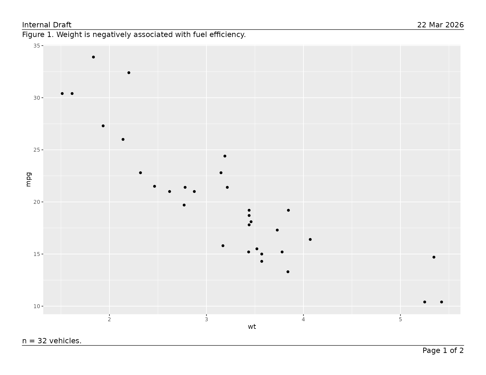
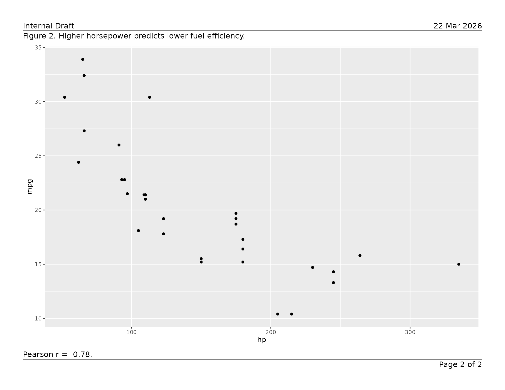
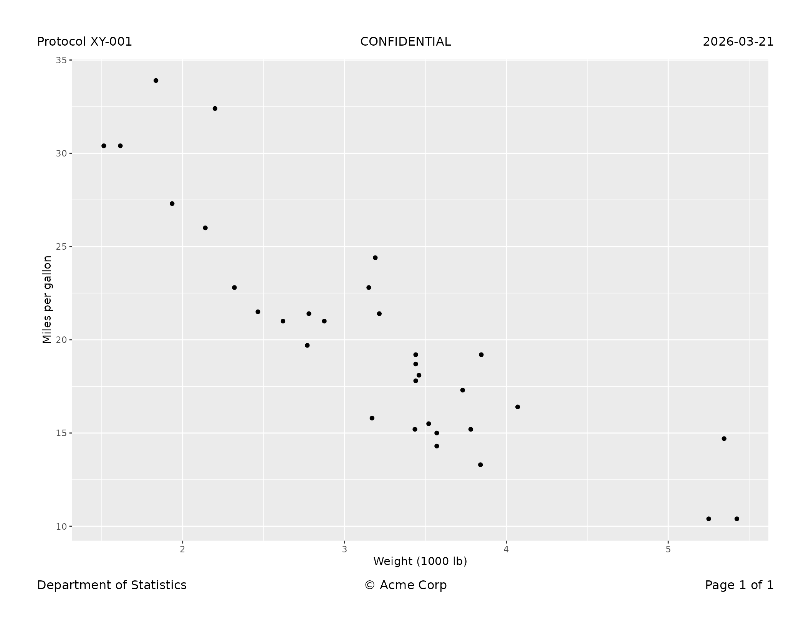
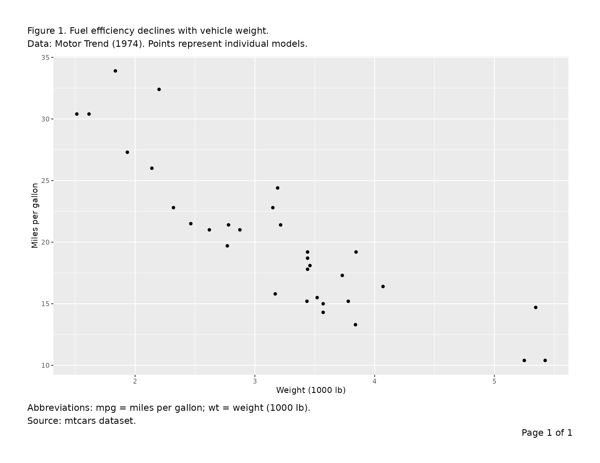
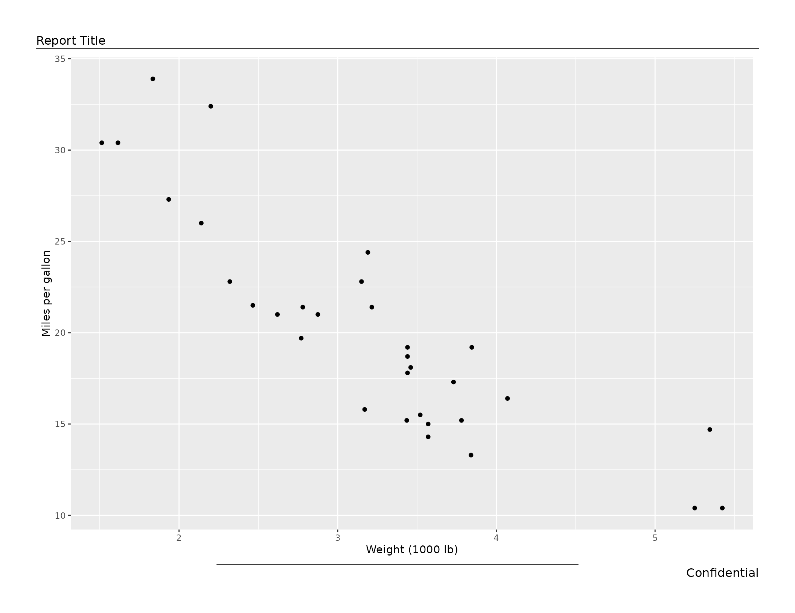
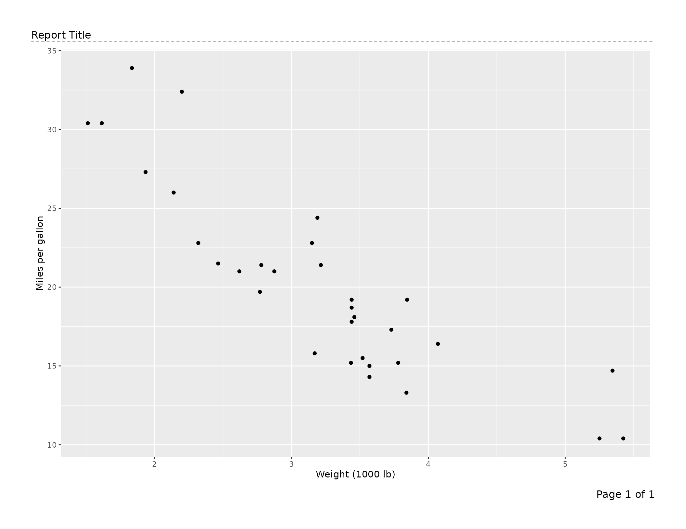
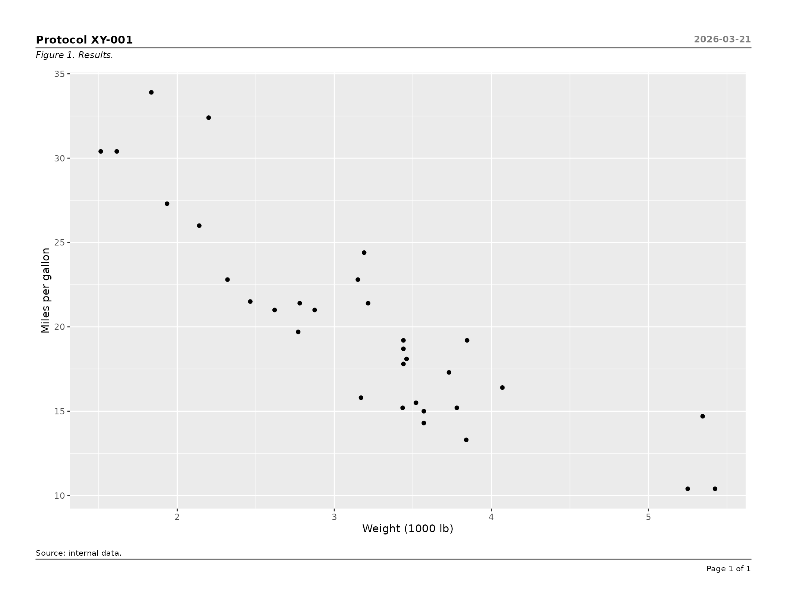
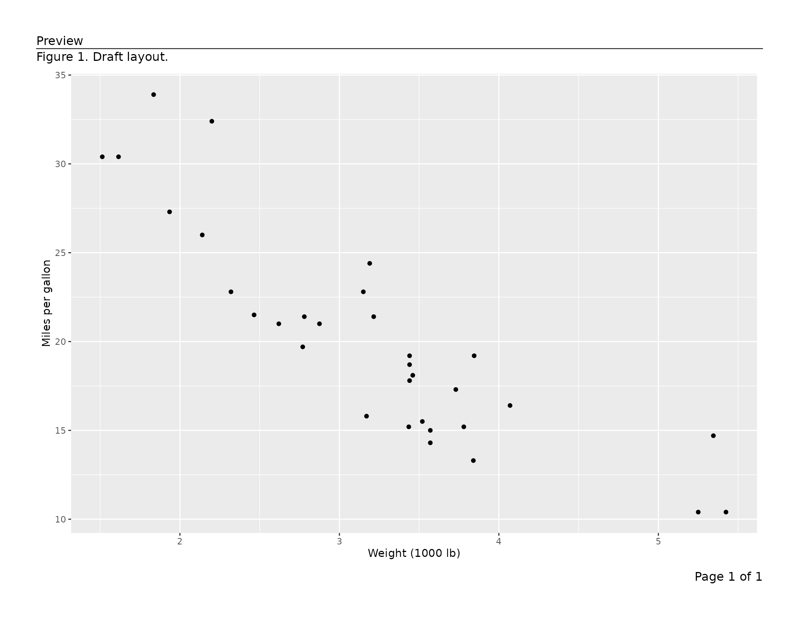

# Exporting Figures to PDF

This vignette covers
[`export_tfl()`](https://humanpred.github.io/writetfl/reference/export_tfl.md)
and
[`export_tfl_page()`](https://humanpred.github.io/writetfl/reference/export_tfl_page.md)
as used with `ggplot2` figures and grid grobs. For data-frame table
output, see
[`vignette("v02-tfl_table_intro")`](https://humanpred.github.io/writetfl/articles/v02-tfl_table_intro.md)
and
[`vignette("v03-tfl_table_styling")`](https://humanpred.github.io/writetfl/articles/v03-tfl_table_styling.md).

``` r
library(writetfl)
library(ggplot2)
library(grid)   # for linesGrob()
```

------------------------------------------------------------------------

## Typical use

### Saving a single figure

Pass one `ggplot` object directly. A page number (`"Page 1 of 1"`) is
added to the bottom-right corner automatically.

``` r
p <- ggplot(mtcars, aes(wt, mpg)) +
  geom_point() +
  labs(x = "Weight (1000 lb)", y = "Miles per gallon")

export_tfl(p, preview = TRUE)
```


### A report with a header on every page

Supply shared annotations via `...`; they apply to every page. Here the
report title goes top-left and the date top-right, separated from the
content by a full-width rule.

``` r
plots <- list(
  list(content = ggplot(mtcars, aes(wt,  mpg)) + geom_point() +
                   labs(title = "Weight vs MPG")),
  list(content = ggplot(mtcars, aes(hp,  mpg)) + geom_point() +
                   labs(title = "Horsepower vs MPG")),
  list(content = ggplot(mtcars, aes(disp, mpg)) + geom_point() +
                   labs(title = "Displacement vs MPG"))
)

export_tfl(
  plots,
  file         = "report.pdf",
  header_left  = "Fuel Economy Analysis",
  header_right = format(Sys.Date(), "%d %b %Y"),
  header_rule  = TRUE
)
```

### Per-page captions and footnotes

Put text that differs per page inside each page’s list element. Per-page
values always override the shared defaults supplied via `...`.

``` r
pages <- list(
  list(
    content  = ggplot(mtcars, aes(wt, mpg))  + geom_point(),
    caption  = "Figure 1. Weight is negatively associated with fuel efficiency.",
    footnote = "n = 32 vehicles."
  ),
  list(
    content  = ggplot(mtcars, aes(hp, mpg))  + geom_point(),
    caption  = "Figure 2. Higher horsepower predicts lower fuel efficiency.",
    footnote = "Pearson r = -0.78."
  )
)

export_tfl(
  pages,
  preview      = TRUE,
  header_left  = "Internal Draft",
  header_right = format(Sys.Date(), "%d %b %Y"),
  header_rule  = TRUE,
  footer_rule  = TRUE
)
```



### Using grid grobs as content

Any grid grob is accepted as `content`, so figures and hand-assembled
grobs can be mixed in one multi-page PDF. The example below uses
`gridExtra::tableGrob()` to drop a plain matrix table onto a page
alongside a figure.

``` r
# Any grid grob works as content
library(gridExtra)
tbl_grob <- tableGrob(head(mtcars[, 1:5], 10))

export_tfl(
  list(
    list(
      content  = tbl_grob,
      caption  = "Table 1. First 10 rows of the mtcars dataset.",
      footnote = "Source: Motor Trend (1974)."
    ),
    list(
      content = ggplot(mtcars, aes(wt, mpg)) + geom_point(),
      caption = "Figure 1. Weight vs MPG."
    )
  ),
  file        = "mixed.pdf",
  header_left = "Analysis Report",
  header_rule = TRUE
)
```

For richly paginated data-frame tables — with automatic column widths,
word-wrapping, row and column pagination, and group-aware page breaks —
use
[`tfl_table()`](https://humanpred.github.io/writetfl/reference/tfl_table.md)
instead. See
[`vignette("v02-tfl_table_intro")`](https://humanpred.github.io/writetfl/articles/v02-tfl_table_intro.md)
for details.

------------------------------------------------------------------------

## All features, roughly in order of use

### Page dimensions and margins

The defaults are landscape letter (11 × 8.5 in) with half-inch margins
on all sides. Override any of these:

``` r
export_tfl(
  p,
  file      = "portrait.pdf",
  pg_width  = 8.5,
  pg_height = 11,
  margins   = unit(c(t = 1, r = 0.75, b = 1, l = 0.75), "inches")
)
```

### Automatic page numbering

By default the footer right reads `"Page {i} of {n}"`. Supply a
[glue](https://glue.tidyverse.org/) template to change the format, or
`NULL` to turn it off entirely.

``` r
# Custom format
export_tfl(plots, file = "numbered.pdf",
  page_num = "{i}/{n}")

# No page numbers
export_tfl(plots, file = "no-numbers.pdf",
  page_num = NULL)
```

Any `footer_right` value — whether supplied via `...` or inside a page
list element — silently overrides `page_num` for that page.

``` r
pages_custom <- list(
  list(content = p, footer_right = "Appendix A"),   # overrides page_num
  list(content = p)                                 # gets "Page 2 of 2"
)
export_tfl(pages_custom, file = "mixed.pdf")
```

### All header and footer positions

Both the header and footer rows have left, centre, and right slots. Any
combination can be used; absent slots consume no space.

``` r
export_tfl(
  p,
  preview       = TRUE,
  header_left   = "Protocol XY-001",
  header_center = "CONFIDENTIAL",
  header_right  = "2026-03-21",
  footer_left   = "Department of Statistics",
  footer_center = "\u00a9 Acme Corp",
  footer_right  = "Page 1 of 1"
)
```



### Multi-line text

Pass a character vector to any text argument; elements are joined with
`"\n"`. Alternatively, embed `"\n"` directly in a string. Both styles
are equivalent and both affect the reserved section height
automatically.

``` r
export_tfl(
  p,
  preview  = TRUE,
  caption  = c(
    "Figure 1. Fuel efficiency declines with vehicle weight.",
    "Data: Motor Trend (1974). Points represent individual models."
  ),
  footnote = "Abbreviations: mpg = miles per gallon; wt = weight (1000 lb).\nSource: mtcars dataset."
)
```



### Separator rules

`header_rule` draws a line between the header row and the caption or
content. `footer_rule` draws a line between the content or footnote and
the footer row. Both live inside the padding gap and do not add height.

| Value             | Effect                                      |
|-------------------|---------------------------------------------|
| `FALSE` (default) | no rule                                     |
| `TRUE`            | full-width rule                             |
| `0.5`             | rule at 50 % of the viewport width, centred |
| `linesGrob(...)`  | custom grob, drawn as-is                    |

``` r
# Full-width header rule, half-width footer rule
export_tfl(
  p,
  preview      = TRUE,
  header_left  = "Report Title",
  footer_right = "Confidential",
  header_rule  = TRUE,
  footer_rule  = 0.5
)
```



``` r

# Custom grob: dashed rule
dashed_rule <- linesGrob(
  x   = unit(c(0, 1), "npc"),
  y   = unit(c(0.5, 0.5), "npc"),
  gp  = gpar(lty = "dashed", col = "gray60"),
  name = "dashed"
)
export_tfl(
  p,
  preview     = TRUE,
  header_left = "Report Title",
  header_rule = dashed_rule
)
```



### Typography with `gp`

Pass a single [`gpar()`](https://rdrr.io/r/grid/gpar.html) to style all
text uniformly, or a named list for section- or element-level control.
Resolution priority (highest wins): element → section → global.

``` r
# All annotation text at 10 pt
export_tfl(
  p,
  file        = "gp-global.pdf",
  header_left = "Report",
  caption     = "Figure 1.",
  gp          = gpar(fontsize = 10)
)
```

``` r
# Section-level and element-level overrides
export_tfl(
  p,
  preview      = TRUE,
  header_left  = "Protocol XY-001",
  header_right = "2026-03-21",
  caption      = "Figure 1. Results.",
  footnote     = "Source: internal data.",
  header_rule  = TRUE,
  footer_rule  = TRUE,
  gp = list(
    header       = gpar(fontsize = 11, fontface = "bold"),
    header_right = gpar(fontsize =  9, col = "gray50"),
    caption      = gpar(fontsize =  9, fontface = "italic"),
    footnote     = gpar(fontsize =  8),
    footer       = gpar(fontsize =  8)
  )
)
```



### Caption and footnote justification

``` r
export_tfl(
  p,
  file          = "centred-caption.pdf",
  caption       = "Figure 1. Centred caption text.",
  footnote      = "Right-aligned footnote.",
  caption_just  = "centre",
  footnote_just = "right"
)
```

### Controlling inter-section padding

`padding` sets the vertical gap between any two adjacent present
sections. Rules are drawn at the midpoint of this gap. Increase it for
more breathing room or decrease it to pack the layout tightly.

``` r
export_tfl(
  p,
  file        = "tight.pdf",
  header_left = "Header",
  caption     = "Caption",
  footnote    = "Footnote",
  padding     = unit(0.08, "lines")
)
```

### Minimum content height guard

`min_content_height` (default `unit(3, "inches")`) prevents the content
area from being squeezed to an unreadable size. If the computed content
height falls below this threshold after all other sections are placed,
the call errors with an informative message before any drawing occurs.

``` r
# Relax the guard for a very tall annotation stack
export_tfl(
  p,
  file               = "tall-annotations.pdf",
  pg_height          = 6,
  header_left        = "Title",
  caption            = paste(rep("Long caption. ", 20), collapse = ""),
  min_content_height = unit(1.5, "inches")
)
```

### Overlap detection

When left and right header or footer text are wide enough to risk
collision, `writetfl` warns or errors automatically.

- Gap \< 0 (true overlap) → error before drawing.
- 0 ≤ gap \< `overlap_warn_mm` mm →
  [`rlang::warn()`](https://rlang.r-lib.org/reference/abort.html)
  (drawing still proceeds).
- `overlap_warn_mm = NULL` → detection disabled entirely.

``` r
# Tighten the warning threshold to catch moderate crowding early
export_tfl(
  p,
  file            = "overlap-check.pdf",
  header_left     = "A moderately long left header",
  header_right    = "A moderately long right header",
  overlap_warn_mm = 20
)

# Silence overlap detection for a layout you have manually verified
export_tfl(
  p,
  file            = "no-overlap-check.pdf",
  header_left     = "Left",
  header_right    = "Right",
  overlap_warn_mm = NULL
)
```

### Preview mode (interactive layout tuning)

`preview = TRUE` in
[`export_tfl()`](https://humanpred.github.io/writetfl/reference/export_tfl.md)
draws to the current device without opening or closing a PDF. Pass
specific page numbers as an integer vector (e.g. `preview = c(1, 3)`) to
render only those pages. Both are useful for interactive inspection in
RStudio or Positron, and for rendering inline graphics in vignettes and
reports.

The lower-level
[`export_tfl_page()`](https://humanpred.github.io/writetfl/reference/export_tfl_page.md)
also accepts `preview = TRUE`, which is useful when building a single
page interactively:

``` r
export_tfl_page(
  x            = list(content = p),
  header_left  = "Preview",
  caption      = "Figure 1. Draft layout.",
  footer_right = "Page 1 of 1",
  header_rule  = TRUE,
  preview      = TRUE
)
```



To iterate quickly, call this repeatedly until the layout looks right,
then switch to
[`export_tfl()`](https://humanpred.github.io/writetfl/reference/export_tfl.md)
for the final PDF.

------------------------------------------------------------------------

## Reference: argument priority order

When
[`export_tfl()`](https://humanpred.github.io/writetfl/reference/export_tfl.md)
is used, the same argument can be specified at up to three levels. The
highest-priority value wins:

| Priority    | Where set                                                                                         | Example                                   |
|-------------|---------------------------------------------------------------------------------------------------|-------------------------------------------|
| 1 (highest) | Inside a page list element                                                                        | `list(content = p, caption = "Per-page")` |
| 2           | `...` of [`export_tfl()`](https://humanpred.github.io/writetfl/reference/export_tfl.md)           | `export_tfl(..., caption = "Shared")`     |
| 3 (lowest)  | [`export_tfl_page()`](https://humanpred.github.io/writetfl/reference/export_tfl_page.md) defaults | `caption = NULL`                          |

`page_num` is applied after this merging: it populates `footer_right`
only if `footer_right` remains `NULL` after steps 1 and 2.
