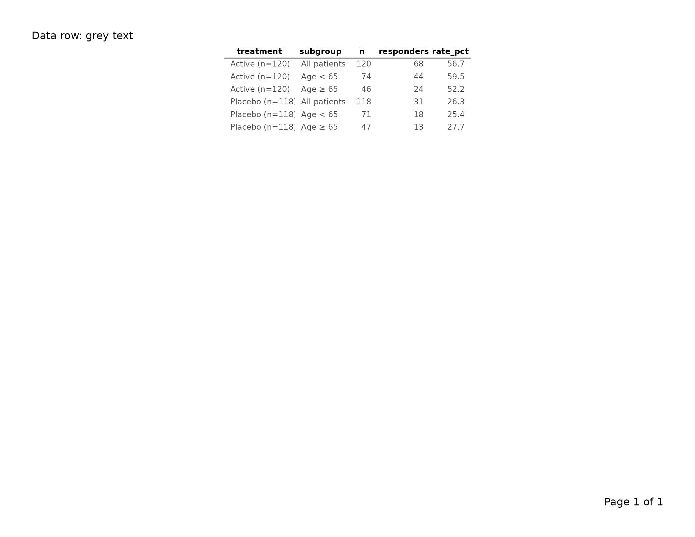

# Styling Tables with tfl_table

``` r
library(writetfl)
library(dplyr)   # for group_by()
#> 
#> Attaching package: 'dplyr'
#> The following objects are masked from 'package:stats':
#> 
#>     filter, lag
#> The following objects are masked from 'package:base':
#> 
#>     intersect, setdiff, setequal, union
```

``` r
# Clinical data and column spec used throughout this vignette.
# treatment is the first column so it can serve as the group column.
clinical <- data.frame(
  treatment  = c(rep("Active (n=120)", 3),       rep("Placebo (n=118)", 3)),
  subgroup   = c("All patients", "Age < 65",    "Age \u2265 65",
                 "All patients", "Age < 65",    "Age \u2265 65"),
  n          = c(120L,  74L,  46L,  118L,  71L,  47L),
  responders = c( 68L,  44L,  24L,   31L,  18L,  13L),
  rate_pct   = c(56.7, 59.5, 52.2,  26.3, 25.4, 27.7),
  stringsAsFactors = FALSE
)

col_spec <- list(
  tfl_colspec("treatment",  label = "Treatment Arm",  width = unit(1.3, "inches")),
  tfl_colspec("subgroup",   label = "Subgroup",       width = unit(1.4, "inches")),
  tfl_colspec("n",          label = "N",              width = unit(0.4, "inches")),
  tfl_colspec("responders", label = "Resp.",          width = unit(0.5, "inches")),
  tfl_colspec("rate_pct",   label = "Rate (%)",       width = unit(0.65, "inches"))
)
```

------------------------------------------------------------------------

## 1. Overview

[`tfl_table()`](https://humanpred.github.io/writetfl/reference/tfl_table.md)
accepts a `gp` argument that is a **named list of
[`gpar()`](https://rdrr.io/r/grid/gpar.html) objects**. Each key targets
a specific visual element of the rendered table. Keys that are not
supplied fall back to sensible clinical defaults; you only need to
specify the elements you want to change.

The full set of recognized keys is:

| Key                  | Targets                                | Default                                           |
|----------------------|----------------------------------------|---------------------------------------------------|
| `gp$table`           | Base font for all table text           | `gpar(fontsize = 9, fontfamily = "sans")`         |
| `gp$header_row`      | Column header row text                 | `gpar(fontface = "bold")` (inherits `gp$table`)   |
| `gp$data_row`        | Data cell text                         | inherits `gp$table`                               |
| `gp$group_col`       | Row-header column text                 | inherits `gp$table`                               |
| `gp$continued`       | Continuation marker text               | `gpar(fontface = "italic")` (inherits `gp$table`) |
| `gp$col_header_rule` | Rule drawn under column header row     | `gpar(lwd = 1)`                                   |
| `gp$group_rule`      | Rules drawn between groups             | `gpar(lwd = 0.5, lty = "dotted")`                 |
| `gp$row_header_sep`  | Vertical rule after row-header columns | `gpar(lwd = 0.5)`                                 |

Inheritance is cascading: `gp$data_row` starts from `gp$table`, so
setting `gp$table = gpar(fontsize = 8)` automatically shrinks data cells
unless you explicitly override `gp$data_row`.

Page-level typography — the text in the page header, caption, footnote,
and footer zones — is controlled by the `gp` argument of
[`export_tfl_page()`](https://humanpred.github.io/writetfl/reference/export_tfl_page.md)
/
[`export_tfl()`](https://humanpred.github.io/writetfl/reference/export_tfl.md),
not by
[`tfl_table()`](https://humanpred.github.io/writetfl/reference/tfl_table.md)’s
`gp`.

------------------------------------------------------------------------

## 2. Base font — `gp$table`

`gp$table` is the typographic root for the whole table. Every other `gp`
key inherits from it unless overridden.

``` r
tbl <- tfl_table(
  clinical,
  gp = list(
    table = gpar(fontsize = 8, fontfamily = "serif")
  )
)

export_tfl(tbl, preview = TRUE, header_left = "Base font: serif 8pt")
```


Changing `gp$table` propagates to all rows and rules unless you
selectively override a more specific key.

------------------------------------------------------------------------

## 3. Column header row style — `gp$header_row` and `show_col_names`

The column header row renders the column names (or labels supplied via
[`tfl_colspec()`](https://humanpred.github.io/writetfl/reference/tfl_colspec.md)).
By default headers are **bold** at the base font size.

``` r
# Custom header: slightly larger, italic instead of bold
tbl <- tfl_table(
  clinical,
  gp = list(
    table      = gpar(fontsize = 9),
    header_row = gpar(fontface = "italic", fontsize = 10)
  )
)

export_tfl(tbl, preview = TRUE, header_left = "Header row: italic 10pt")
```


Set `show_col_names = FALSE` to suppress the header row entirely —
useful when you are stacking multiple `tfl_table` objects on one page
and only the first needs column labels.

``` r
tbl_no_header <- tfl_table(
  clinical,
  show_col_names = FALSE
)

export_tfl(tbl_no_header, preview = TRUE,
           header_left = "show_col_names = FALSE")
```


------------------------------------------------------------------------

## 4. Data row style — `gp$data_row`

`gp$data_row` controls the appearance of every non-header,
non-group-column cell. It inherits `gp$table` automatically.

``` r
tbl <- tfl_table(
  clinical,
  gp = list(
    table    = gpar(fontsize = 9),
    data_row = gpar(col = "grey30")
  )
)

export_tfl(tbl, preview = TRUE, header_left = "Data row: grey text")
```



------------------------------------------------------------------------

## 5. Group column style — `gp$group_col` and per-column override

Row-header (group) columns — those designated via
[`dplyr::group_by()`](https://dplyr.tidyverse.org/reference/group_by.html)
— receive their own style key, `gp$group_col`, which also inherits
`gp$table`.

``` r
# Bold group column to distinguish it from data columns
tbl <- clinical |>
  group_by(treatment) |>
  tfl_table(
    cols = list(
      tfl_colspec("treatment",  label = "Treatment Arm", width = unit(1.3, "inches")),
      tfl_colspec("subgroup",   label = "Subgroup",      width = unit(1.4, "inches")),
      tfl_colspec("n",          label = "N",             width = unit(0.4, "inches")),
      tfl_colspec("rate_pct",   label = "Rate (%)",      width = unit(0.65, "inches"))
    ),
    gp = list(
      group_col = gpar(fontface = "bold")
    )
  )

export_tfl(tbl, preview = TRUE, header_left = "Group column: bold")
```


To override a **single** group column without touching the others, pass
`gp` directly to
[`tfl_colspec()`](https://humanpred.github.io/writetfl/reference/tfl_colspec.md):

``` r
# The treatment group column gets bold via its tfl_colspec gp;
# any other group columns would stay at the gp$group_col default
tbl <- clinical |>
  group_by(treatment) |>
  tfl_table(
    cols = list(
      tfl_colspec("treatment",  label = "Treatment Arm", width = unit(1.3, "inches"),
                  gp = gpar(fontface = "bold")),
      tfl_colspec("subgroup",   label = "Subgroup",      width = unit(1.4, "inches")),
      tfl_colspec("n",          label = "N",             width = unit(0.4, "inches")),
      tfl_colspec("rate_pct",   label = "Rate (%)",      width = unit(0.65, "inches"))
    )
  )

export_tfl(tbl, preview = TRUE,
           header_left = "Per-colspec gp overrides group_col gp")
```


The `gp` on
[`tfl_colspec()`](https://humanpred.github.io/writetfl/reference/tfl_colspec.md)
takes precedence over `gp$group_col` for that specific column; all other
group columns still inherit `gp$group_col`.

------------------------------------------------------------------------

## 6. Continuation marker style — `gp$continued` and `row_cont_msg`

When a table spans multiple pages,
[`tfl_table()`](https://humanpred.github.io/writetfl/reference/tfl_table.md)
injects a continuation marker at the bottom of each non-final page. By
default the marker text is `"(continued)"` and is rendered in italic.

``` r
# Smaller continuation marker, explicit message
tbl <- tfl_table(
  clinical,
  row_cont_msg = "(table continues on next page)",
  gp = list(
    continued = gpar(fontface = "italic", fontsize = 7, col = "grey50")
  )
)
```

`row_cont_msg` replaces the default `"(continued)"` string.
`gp$continued` controls the visual rendering of whatever text
`row_cont_msg` provides. The continuation marker only appears on tables
with more rows than fit on one page; see
[`vignette("v02-tfl_table_intro")`](https://humanpred.github.io/writetfl/articles/v02-tfl_table_intro.md)
for an example.

------------------------------------------------------------------------

## 7. Horizontal rules — `col_header_rule`, `group_rule`, `group_rule_after_last`

Three boolean arguments switch rules on or off; their corresponding `gp`
keys control line appearance.

### Column header rule

A horizontal rule drawn immediately below the column header row.

``` r
# Thicker header rule
tbl <- tfl_table(
  clinical,
  col_header_rule = TRUE,
  gp = list(
    col_header_rule = gpar(lwd = 1.5)
  )
)

export_tfl(tbl, preview = TRUE, header_left = "Header rule: lwd = 1.5")
```


``` r

# No header rule at all
tbl_no_rule <- tfl_table(
  clinical,
  col_header_rule = FALSE
)

export_tfl(tbl_no_rule, preview = TRUE,
           header_left = "col_header_rule = FALSE")
```


### Between-group rules

A rule drawn after each group of rows (defined by changes in the first
group column). `group_rule_after_last` controls whether a rule also
appears after the final group.

``` r
# Solid thin rules between groups, including after the last one
tbl <- clinical |>
  group_by(treatment) |>
  tfl_table(
    cols                  = col_spec,
    group_rule            = TRUE,
    group_rule_after_last = TRUE,
    gp = list(
      group_rule = gpar(lwd = 0.5, lty = "solid")
    )
  )

export_tfl(tbl, preview = TRUE,
           header_left = "Group rules: solid, including after last")
```


``` r

# No between-group rules
tbl_no_grp <- clinical |>
  group_by(treatment) |>
  tfl_table(
    cols       = col_spec,
    group_rule = FALSE
  )

export_tfl(tbl_no_grp, preview = TRUE,
           header_left = "group_rule = FALSE")
```


The default `gp$group_rule` is `gpar(lwd = 0.5, lty = "dotted")`. Any
valid `lty` value accepted by `grid` (e.g. `"dashed"`, `"solid"`,
`"dotted"`) works here.

------------------------------------------------------------------------

## 8. Vertical row-header separator — `row_header_sep` and `gp$row_header_sep`

A vertical rule drawn to the right of the last row-header (group)
column, separating the row labels from the data columns. Enabled with
`row_header_sep = TRUE`.

``` r
# Thin solid vertical separator after the group column
tbl <- clinical |>
  group_by(treatment) |>
  tfl_table(
    cols = list(
      tfl_colspec("treatment",  label = "Treatment Arm", width = unit(1.3, "inches")),
      tfl_colspec("subgroup",   label = "Subgroup",      width = unit(1.4, "inches")),
      tfl_colspec("n",          label = "N",             width = unit(0.4, "inches")),
      tfl_colspec("rate_pct",   label = "Rate (%)",      width = unit(0.65, "inches"))
    ),
    row_header_sep = TRUE,
    gp = list(
      row_header_sep = gpar(lwd = 0.75, col = "grey40")
    )
  )

export_tfl(tbl, preview = TRUE,
           header_left = "Row header separator")
```


``` r

# Suppress the separator (default)
tbl_no_sep <- clinical |>
  group_by(treatment) |>
  tfl_table(
    cols           = col_spec,
    row_header_sep = FALSE
  )

export_tfl(tbl_no_sep, preview = TRUE,
           header_left = "row_header_sep = FALSE (default)")
```


------------------------------------------------------------------------

## 9. Cell padding — `cell_padding`

`cell_padding` is a [`grid::unit`](https://rdrr.io/r/grid/unit.html)
object that controls the whitespace between cell content and cell
boundaries. It accepts two forms:

**Scalar** — the same padding is applied on all four sides:

``` r
tbl <- tfl_table(
  clinical,
  cell_padding = unit(0.15, "lines")
)

export_tfl(tbl, preview = TRUE, header_left = "Uniform padding: 0.15 lines")
```


**Two-element vector** — separate vertical and horizontal padding. Use
this when you want tighter horizontal spacing but more vertical
breathing room:

``` r
tbl <- tfl_table(
  clinical,
  cell_padding = unit(c(0.3, 0.1), "lines")   # [1] = vertical, [2] = horizontal
)

export_tfl(tbl, preview = TRUE,
           header_left = "Asymmetric padding: 0.3v / 0.1h lines")
```


The first element controls top and bottom padding; the second controls
left and right. Reducing horizontal padding allows more columns to fit
on a page without reducing font size.

------------------------------------------------------------------------

## 10. Column continuation message — `col_cont_msg`

When the table has more columns than fit on one page,
[`tfl_table()`](https://humanpred.github.io/writetfl/reference/tfl_table.md)
splits across multiple column-pages. `col_cont_msg` is a character
string displayed as rotated side labels:

- **Clockwise 90°** (reading downward) to the **right** of the table on
  pages where columns continue on a subsequent page.
- **Counter-clockwise 90°** (reading upward) to the **left** of the full
  table (including row-label columns) on pages where columns continue
  from a prior page.

One line-height of spacing separates the table edge from the text. Set
`col_cont_msg = NULL` to suppress the labels entirely.

``` r
# Default message
tbl <- tfl_table(
  clinical,
  col_cont_msg = "Columns continue on next page"
)

# Suppress
tbl_no_msg <- tfl_table(
  clinical,
  col_cont_msg = NULL
)
```

------------------------------------------------------------------------

## 11. Complete example: clinical default vs. publication style

The following pair of examples contrasts the out-of-the-box clinical
appearance with a more compact publication-style variant. Both render
using `preview = TRUE`.

### Default clinical look

``` r
tbl_clinical <- clinical |>
  group_by(treatment) |>
  tfl_table(
    cols                  = col_spec,
    col_header_rule       = TRUE,
    group_rule            = TRUE,
    group_rule_after_last = FALSE,
    row_header_sep        = TRUE,
    cell_padding          = unit(0.2, "lines")
    # gp uses built-in defaults: bold headers, dotted group rules, etc.
  )

export_tfl(
  tbl_clinical,
  preview        = TRUE,
  pg_width       = 11,
  pg_height      = 8.5,
  header_left    = "Study XYZ-001",
  header_right   = "CONFIDENTIAL",
  caption        = "Table 1. Response rates by treatment arm and age subgroup.",
  footnote       = "Abbreviations: Resp. = responders; Rate = response rate.",
  footer_left    = "Program: t_resp.R",
  margins        = unit(c(t = 0.75, r = 0.75, b = 0.75, l = 0.75), "inches")
)
```


### Publication style

``` r
tbl_publication <- clinical |>
  group_by(treatment) |>
  tfl_table(
    cols                  = col_spec,
    col_header_rule       = TRUE,
    group_rule            = FALSE,   # no between-group rules
    group_rule_after_last = FALSE,
    row_header_sep        = FALSE,   # no vertical separator
    cell_padding          = unit(c(0.25, 0.08), "lines"),
    gp = list(
      # smaller, serif base font
      table           = gpar(fontsize = 8, fontfamily = "serif"),
      # plain (not bold) column headers, slightly larger
      header_row      = gpar(fontface = "plain", fontsize = 9, fontfamily = "serif"),
      # italicized group column
      group_col       = gpar(fontface = "italic"),
      # heavier header rule
      col_header_rule = gpar(lwd = 1.5),
      # smaller, lighter continuation marker
      continued       = gpar(fontface = "italic", fontsize = 7, col = "grey60")
    )
  )

export_tfl(
  tbl_publication,
  preview        = TRUE,
  pg_width       = 8.5,
  pg_height      = 11,
  caption        = "Table 1. Response rates by treatment arm and age subgroup.",
  footnote       = "Resp. = responders; Rate (%) = response rate.",
  margins        = unit(c(t = 1, r = 1, b = 1, l = 1), "inches")
)
```


The two outputs differ visibly in:

- Font family and weight (sans-serif bold headers vs. serif plain
  headers)
- Presence of group rules and the vertical row-header separator
- Cell padding (uniform vs. asymmetric v/h form)
- Header rule weight
- Continuation marker appearance
