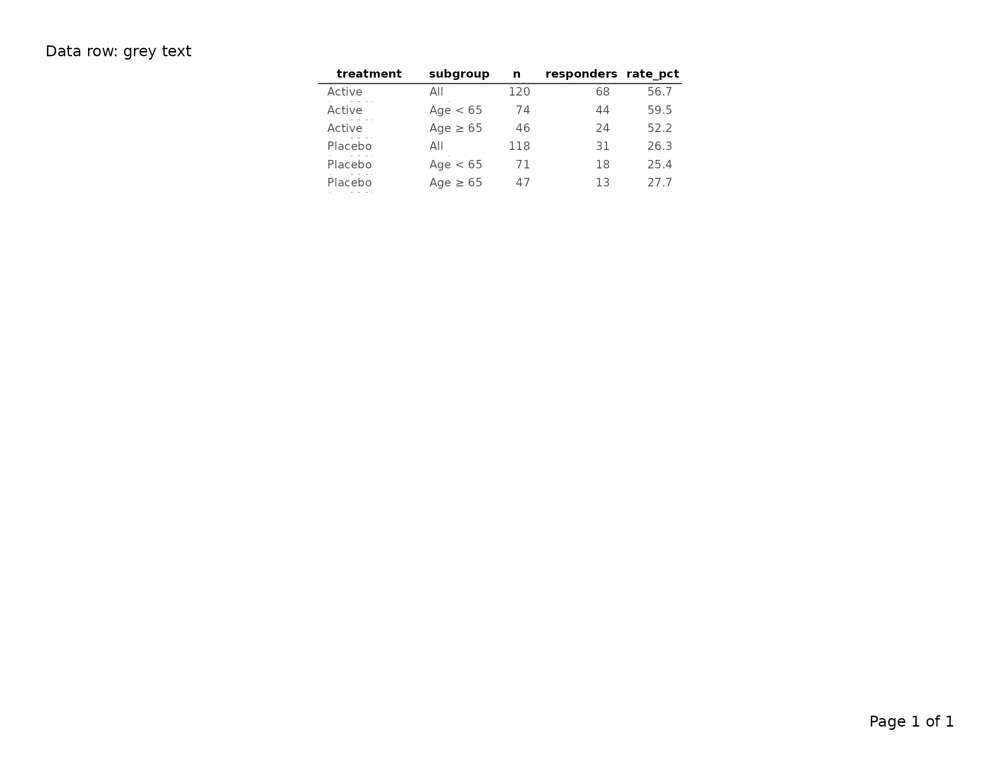
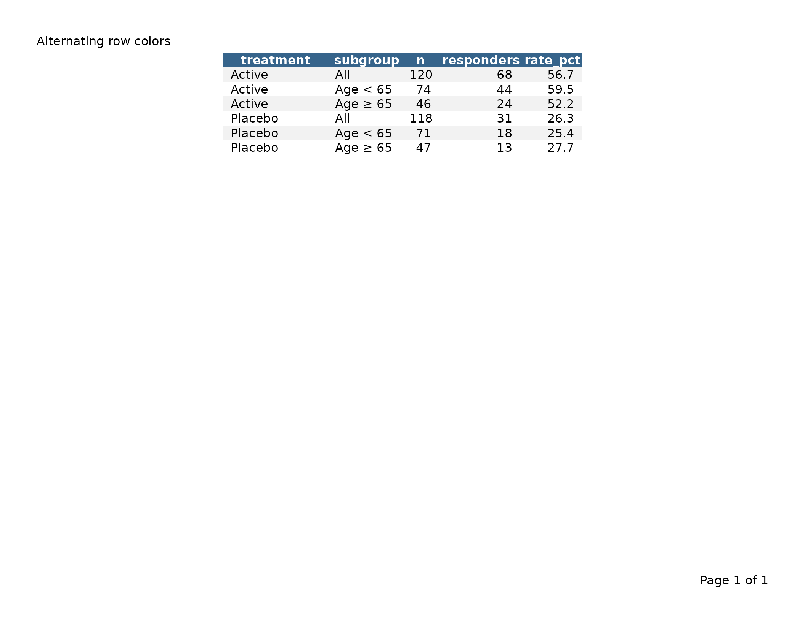
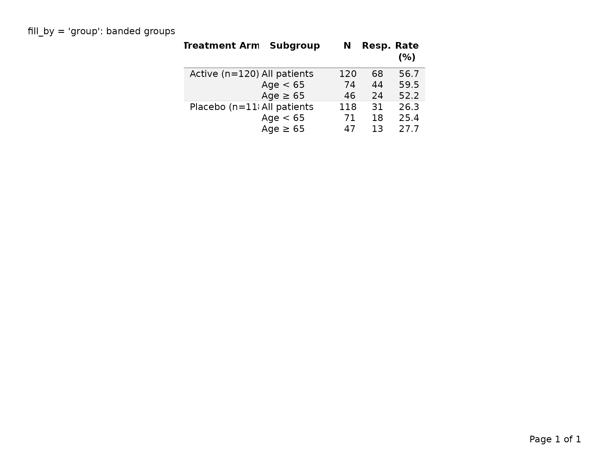

# Styling Tables with tfl_table

``` r

library(writetfl)
library(dplyr)   # for group_by()
#> 
#> Attaching package: 'dplyr'
#> The following objects are masked from 'package:stats':
#> 
#>     filter, lag
#> The following objects are masked from 'package:base':
#> 
#>     intersect, setdiff, setequal, union
```

``` r

# Clinical data and column spec used throughout this vignette.
# treatment is the first column so it can serve as the group column.
clinical <- data.frame(
  treatment  = c(rep("Active (n=120)", 3),       rep("Placebo (n=118)", 3)),
  subgroup   = c("All patients", "Age < 65",    "Age ≥ 65",
                 "All patients", "Age < 65",    "Age ≥ 65"),
  n          = c(120L,  74L,  46L,  118L,  71L,  47L),
  responders = c( 68L,  44L,  24L,   31L,  18L,  13L),
  rate_pct   = c(56.7, 59.5, 52.2,  26.3, 25.4, 27.7),
  stringsAsFactors = FALSE
)

col_spec <- list(
  tfl_colspec("treatment",  label = "Treatment Arm",  width = unit(1.3, "inches")),
  tfl_colspec("subgroup",   label = "Subgroup",       width = unit(1.4, "inches")),
  tfl_colspec("n",          label = "N",              width = unit(0.4, "inches")),
  tfl_colspec("responders", label = "Resp.",          width = unit(0.5, "inches")),
  tfl_colspec("rate_pct",   label = "Rate (%)",       width = unit(0.65, "inches"))
)
```

------------------------------------------------------------------------

## Overview

[`tfl_table()`](https://humanpred.github.io/writetfl/reference/tfl_table.md)
accepts a `gp` argument that is a **named list of
[`gpar()`](https://rdrr.io/r/grid/gpar.html) objects**. Each key targets
a specific visual element of the rendered table. Keys that are not
supplied fall back to sensible clinical defaults; you only need to
specify the elements you want to change.

The full set of recognized keys is:

| Key | Targets | Default |
|----|----|----|
| `gp$table` | Base font for all table text | `gpar(fontsize = 9, fontfamily = "sans")` |
| `gp$header_row` | Column header row text; `fill` sets background color | `gpar(fontface = "bold")` (inherits `gp$table`) |
| `gp$data_row` | Data cell text; `fill` sets background (vector alternates) | inherits `gp$table` |
| `gp$group_col` | Row-header column text | inherits `gp$table` |
| `gp$continued` | Continuation marker text | `gpar(fontface = "italic")` (inherits `gp$table`) |
| `gp$col_header_rule` | Rule drawn under column header row | `gpar(lwd = 1)` |
| `gp$group_rule` | Rules drawn between groups | `gpar(lwd = 0.5, lty = "dotted")` |
| `gp$row_rule` | Rules drawn between data rows | `gpar(lwd = 0.5)` |
| `gp$row_header_sep` | Vertical rule after row-header columns | `gpar(lwd = 0.5)` |

Inheritance is cascading: `gp$data_row` starts from `gp$table`, so
setting `gp$table = gpar(fontsize = 8)` automatically shrinks data cells
unless you explicitly override `gp$data_row`.

Page-level typography — the text in the page header, caption, footnote,
and footer zones — is controlled by the `gp` argument of
[`export_tfl_page()`](https://humanpred.github.io/writetfl/reference/export_tfl_page.md)
/
[`export_tfl()`](https://humanpred.github.io/writetfl/reference/export_tfl.md),
not by
[`tfl_table()`](https://humanpred.github.io/writetfl/reference/tfl_table.md)’s
`gp`.

This vignette covers the styling arguments grouped into:

- 
- 
- 
- 
- 
- 
- 

------------------------------------------------------------------------

## Typography

### Base font — `gp$table`

`gp$table` is the typographic root for the whole table. Every other `gp`
key inherits from it unless overridden.

``` r

tbl <- tfl_table(
  clinical,
  gp = list(
    table = gpar(fontsize = 8, fontfamily = "serif")
  )
)

export_tfl(tbl, preview = TRUE, header_left = "Base font: serif 8pt")
```


Changing `gp$table` propagates to all rows and rules unless you
selectively override a more specific key.

### Column header row — `gp$header_row` and `show_col_names`

The column header row renders the column names (or labels supplied via
[`tfl_colspec()`](https://humanpred.github.io/writetfl/reference/tfl_colspec.md)).
By default headers are **bold** at the base font size.

``` r

# Custom header: slightly larger, italic instead of bold
tbl <- tfl_table(
  clinical,
  gp = list(
    table      = gpar(fontsize = 9),
    header_row = gpar(fontface = "italic", fontsize = 10)
  )
)

export_tfl(tbl, preview = TRUE, header_left = "Header row: italic 10pt")
```


Set `show_col_names = FALSE` to suppress the header row entirely —
useful when you are stacking multiple `tfl_table` objects on one page
and only the first needs column labels.

``` r

tbl_no_header <- tfl_table(
  clinical,
  show_col_names = FALSE
)

export_tfl(tbl_no_header, preview = TRUE,
           header_left = "show_col_names = FALSE")
```


### Data row — `gp$data_row`

`gp$data_row` controls the appearance of every non-header,
non-group-column cell. It inherits `gp$table` automatically.

``` r

tbl <- tfl_table(
  clinical,
  gp = list(
    table    = gpar(fontsize = 9),
    data_row = gpar(col = "grey30")
  )
)

export_tfl(tbl, preview = TRUE, header_left = "Data row: grey text")
```



### Group column — `gp$group_col` and per-column override

Row-header (group) columns — those designated via
[`dplyr::group_by()`](https://dplyr.tidyverse.org/reference/group_by.html)
— receive their own style key, `gp$group_col`, which also inherits
`gp$table`.

``` r

# Bold group column to distinguish it from data columns
tbl <- clinical |>
  group_by(treatment) |>
  tfl_table(
    cols = list(
      tfl_colspec("treatment",  label = "Treatment Arm", width = unit(1.3, "inches")),
      tfl_colspec("subgroup",   label = "Subgroup",      width = unit(1.4, "inches")),
      tfl_colspec("n",          label = "N",             width = unit(0.4, "inches")),
      tfl_colspec("rate_pct",   label = "Rate (%)",      width = unit(0.65, "inches"))
    ),
    gp = list(
      group_col = gpar(fontface = "bold")
    )
  )

export_tfl(tbl, preview = TRUE, header_left = "Group column: bold")
```


To override a **single** group column without touching the others, pass
`gp` directly to
[`tfl_colspec()`](https://humanpred.github.io/writetfl/reference/tfl_colspec.md):

``` r

# The treatment group column gets bold via its tfl_colspec gp;
# any other group columns would stay at the gp$group_col default
tbl <- clinical |>
  group_by(treatment) |>
  tfl_table(
    cols = list(
      tfl_colspec("treatment",  label = "Treatment Arm", width = unit(1.3, "inches"),
                  gp = gpar(fontface = "bold")),
      tfl_colspec("subgroup",   label = "Subgroup",      width = unit(1.4, "inches")),
      tfl_colspec("n",          label = "N",             width = unit(0.4, "inches")),
      tfl_colspec("rate_pct",   label = "Rate (%)",      width = unit(0.65, "inches"))
    )
  )

export_tfl(tbl, preview = TRUE,
           header_left = "Per-colspec gp overrides group_col gp")
```


The `gp` on
[`tfl_colspec()`](https://humanpred.github.io/writetfl/reference/tfl_colspec.md)
takes precedence over `gp$group_col` for that specific column; all other
group columns still inherit `gp$group_col`.

### Continuation marker — `gp$continued` and `row_cont_msg`

When a table spans multiple pages,
[`tfl_table()`](https://humanpred.github.io/writetfl/reference/tfl_table.md)
injects a continuation marker at the bottom of each non-final page. By
default the marker text is `"(continued)"` and is rendered in italic.

``` r

# Smaller continuation marker, explicit message
tbl <- tfl_table(
  clinical,
  row_cont_msg = "(table continues on next page)",
  gp = list(
    continued = gpar(fontface = "italic", fontsize = 7, col = "grey50")
  )
)
```

`row_cont_msg` replaces the default `"(continued)"` string.
`gp$continued` controls the visual rendering of whatever text
`row_cont_msg` provides. The continuation marker only appears on tables
with more rows than fit on one page; see
[`vignette("v02-tfl_table_intro")`](https://humanpred.github.io/writetfl/articles/v02-tfl_table_intro.md)
for an example.

------------------------------------------------------------------------

## Rules and separators

Three boolean arguments switch horizontal rules on or off; their
corresponding `gp` keys control line appearance. A vertical separator
between row-headers and data columns is also available.

### Column header rule — `col_header_rule`

A horizontal rule drawn immediately below the column header row.

``` r

# Thicker header rule
tbl <- tfl_table(
  clinical,
  col_header_rule = TRUE,
  gp = list(
    col_header_rule = gpar(lwd = 1.5)
  )
)

export_tfl(tbl, preview = TRUE, header_left = "Header rule: lwd = 1.5")
```


``` r


# No header rule at all
tbl_no_rule <- tfl_table(
  clinical,
  col_header_rule = FALSE
)

export_tfl(tbl_no_rule, preview = TRUE,
           header_left = "col_header_rule = FALSE")
```


### Group rules — `group_rule`, `group_rule_after_last`

A rule drawn at the boundary between adjacent groups (defined by changes
in any group column). `group_rule_after_last` controls whether a rule
also appears after the final group.

The line is drawn as a **partial width**: it starts at the column whose
value actually changed at this transition and extends to the right edge
of the table. So with nested groups `group_vars = c("Cohort", "Visit")`:

| Transition | Outermost change | Rule columns |
|----|----|----|
| Visit changes within the same Cohort | Visit (level 2) | Visit + data columns |
| Cohort changes | Cohort (level 1) | Cohort + Visit + data columns |

This keeps the rule from visually slicing through an outer group’s label
that is flowing across multiple rows (see [Multi-line group labels and
rowspan
flow](https://humanpred.github.io/writetfl/articles/v02-tfl_table_intro.md)
in the intro vignette).

``` r

# Solid thin rules between groups, including after the last one
tbl <- clinical |>
  group_by(treatment) |>
  tfl_table(
    cols                  = col_spec,
    group_rule            = TRUE,
    group_rule_after_last = TRUE,
    gp = list(
      group_rule = gpar(lwd = 0.5, lty = "solid")
    )
  )

export_tfl(tbl, preview = TRUE,
           header_left = "Group rules: solid, including after last")
```


``` r


# No between-group rules
tbl_no_grp <- clinical |>
  group_by(treatment) |>
  tfl_table(
    cols       = col_spec,
    group_rule = FALSE
  )

export_tfl(tbl_no_grp, preview = TRUE,
           header_left = "group_rule = FALSE")
```


The default `gp$group_rule` is `gpar(lwd = 0.5, lty = "dotted")`. Any
valid `lty` value accepted by `grid` (e.g. `"dashed"`, `"solid"`,
`"dotted"`) works here.

### Row rules — `row_rule`

A horizontal rule drawn between every pair of consecutive data rows.
Enabled with `row_rule = TRUE`. Unlike `group_rule` (which only fires at
group boundaries), `row_rule` draws after every row except the last —
**unless** the row below it is part of a multi-row group span. A line
that would slice through a label flowing downward through suppressed
cells is automatically suppressed, the same way HTML rowspan cells have
no internal borders.

``` r

tbl <- tfl_table(
  clinical,
  row_rule = TRUE,
  gp = list(
    row_rule = gpar(lwd = 0.3, col = "grey70")
  )
)

export_tfl(tbl, preview = TRUE,
           header_left = "row_rule = TRUE: lines between rows")
```


The default `gp$row_rule` is `gpar(lwd = 0.5)`. Set `row_rule = FALSE`
(the default) to suppress inter-row rules entirely.

### Vertical row-header separator — `row_header_sep`

A vertical rule drawn to the right of the last row-header (group)
column, separating the row labels from the data columns. Enabled with
`row_header_sep = TRUE`.

``` r

# Thin solid vertical separator after the group column
tbl <- clinical |>
  group_by(treatment) |>
  tfl_table(
    cols = list(
      tfl_colspec("treatment",  label = "Treatment Arm", width = unit(1.3, "inches")),
      tfl_colspec("subgroup",   label = "Subgroup",      width = unit(1.4, "inches")),
      tfl_colspec("n",          label = "N",             width = unit(0.4, "inches")),
      tfl_colspec("rate_pct",   label = "Rate (%)",      width = unit(0.65, "inches"))
    ),
    row_header_sep = TRUE,
    gp = list(
      row_header_sep = gpar(lwd = 0.75, col = "grey40")
    )
  )

export_tfl(tbl, preview = TRUE,
           header_left = "Row header separator")
```


``` r


# Suppress the separator (default)
tbl_no_sep <- clinical |>
  group_by(treatment) |>
  tfl_table(
    cols           = col_spec,
    row_header_sep = FALSE
  )

export_tfl(tbl_no_sep, preview = TRUE,
           header_left = "row_header_sep = FALSE (default)")
```


------------------------------------------------------------------------

## Cell padding

`cell_padding` is a [`grid::unit`](https://rdrr.io/r/grid/unit.html)
object that controls the whitespace between cell content and cell
boundaries. It accepts two forms:

**Scalar** — the same padding is applied on all four sides:

``` r

tbl <- tfl_table(
  clinical,
  cell_padding = unit(0.15, "lines")
)

export_tfl(tbl, preview = TRUE, header_left = "Uniform padding: 0.15 lines")
```


**Two-element vector** — separate vertical and horizontal padding. Use
this when you want tighter horizontal spacing but more vertical
breathing room:

``` r

tbl <- tfl_table(
  clinical,
  cell_padding = unit(c(0.3, 0.1), "lines")   # [1] = vertical, [2] = horizontal
)

export_tfl(tbl, preview = TRUE,
           header_left = "Asymmetric padding: 0.3v / 0.1h lines")
```


The first element controls top and bottom padding; the second controls
left and right. Reducing horizontal padding allows more columns to fit
on a page without reducing font size.

------------------------------------------------------------------------

## Cell background shading

Background colors for the header row and data rows are controlled
through the `fill` field in existing gp keys.

### Header row background

``` r

tbl <- tfl_table(
  clinical,
  gp = list(
    header_row = gpar(fontface = "bold", fill = "lightblue")
  )
)

export_tfl(tbl, preview = TRUE,
           header_left = "Header row with fill = 'lightblue'")
```


### Alternating row colors (zebra striping)

Pass a vector of colors to `gp$data_row$fill` to alternate between them:

``` r

tbl <- tfl_table(
  clinical,
  gp = list(
    header_row = gpar(fontface = "bold", fill = "steelblue4", col = "white"),
    data_row   = gpar(fill = c("grey95", "white"))
  )
)

export_tfl(tbl, preview = TRUE,
           header_left = "Alternating row colors")
```



### Alternating by group — `fill_by = "group"`

By default, `fill_by = "row"` cycles through the color vector for each
data row. Setting `fill_by = "group"` advances the color index only at
group boundaries, so all rows in the same group share one background
color.

``` r

tbl <- clinical |>
  group_by(treatment) |>
  tfl_table(
    cols    = col_spec,
    fill_by = "group",
    gp = list(
      data_row = gpar(fill = c("grey95", "white"))
    )
  )

export_tfl(tbl, preview = TRUE,
           header_left = "fill_by = 'group': banded groups")
```



------------------------------------------------------------------------

## Word wrapping — `wrap_cols`, `wrap_breaks`

`wrap_cols` and `wrap_breaks` control **text wrapping inside columns** —
the table reflows long cell text and column-header labels onto multiple
lines so a column can be narrower. Distinct from
[**page-column-split**](#multi-page-accessories), which handles a table
that is too wide *as a whole* by spreading its columns over more than
one PDF page. The two run in order: text-wrap first; then
page-column-split as a fallback if the table still doesn’t fit.

### Default behaviour — `wrap_cols = "auto"`

Out of the box, every non-group column whose cells or header contain a
break character (whitespace by default) is eligible for wrapping.
Numeric columns and single-token strings are skipped because no amount
of narrowing can make them break. The wrap pass only runs when the
natural column widths exceed the available page width.

``` r

notes_df <- data.frame(
  visit = c("Baseline", "Week 4", "Week 12"),
  notes = c("Patient enrolled and signed informed consent",
            "Mild headache reported, resolved within 24 hours",
            "All scheduled assessments completed without issue")
)
tbl <- tfl_table(notes_df)   # wrap_cols = "auto" by default
```

### Disabling wrap entirely

Pass `wrap_cols = FALSE`. The wrap module is bypassed; if the table is
wider than the page it will fall through to page-column-split (or error
when `allow_col_split = FALSE`).

``` r

tbl <- tfl_table(notes_df, wrap_cols = FALSE)
```

### Per-column control

`tfl_colspec(wrap = ...)` overrides the table-level setting:

- `wrap = TRUE` — always eligible, even when no break character is
  present.
- `wrap = FALSE` — never eligible, even when `wrap_cols = "auto"` would
  mark it.
- `wrap = NA` (default) — inherit from `wrap_cols`.

``` r

tbl <- tfl_table(
  notes_df,
  cols = list(
    tfl_colspec("notes", width = unit(2, "inches"), wrap = TRUE)
  )
)
```

### Custom break characters — `wrap_breaks()`

By default the wrap module breaks on whitespace (space, tab) and
consumes the whitespace at the break point. Pass a
[`wrap_breaks()`](https://humanpred.github.io/writetfl/reference/wrap_breaks.md)
object to configure additional break characters:

- `drop` — characters consumed at the break (whitespace; the default).
- `keep_before` — characters that stay on the **left** of the break,
  with the *next* character starting the new line. Useful for hyphenated
  terms or path-like strings.

``` r

# Break after "-" (hyphenated terms)
tbl <- tfl_table(
  hyphen_df,
  wrap_breaks = wrap_breaks(drop = " ", keep_before = "-")
)

# Break after "/" or "-" (path-like content)
tbl <- tfl_table(
  path_df,
  wrap_breaks = wrap_breaks(drop = " ", keep_before = c("-", "/"))
)
```

### Leading spaces (indentation)

Leading spaces in cell text — a common way to indent sub-category labels
in clinical tables — are **preserved**. The wrap module keeps a line’s
leading spaces as a *hanging indent*: when the text wraps onto
continuation lines, every wrapped line carries the same indent, and the
indent width is counted when deciding where to break (so an indented
line still fits its column).

``` r

df <- data.frame(
  Parameter = c("Adverse events",
                "  Any AE",
                "    Serious AE",
                "    Mild AE"),
  n = c(120L, 95L, 12L, 83L)
)
# The two- and four-space prefixes render exactly as written, and survive
# wrapping if the column is narrowed.
export_tfl(tfl_table(df), file = "ae.pdf")
```

This works in table cells, in column headers, and in page-level
character content, captions, and footnotes. No option is needed — spaces
are taken literally.

### Tabs

The PDF graphics device cannot render the tab glyph (it draws nothing
and warns). `writetfl` therefore expands tabs to spaces before measuring
and drawing:

- A **leading** (indentation) tab — one preceded only by whitespace —
  becomes **two spaces** by default.
- An **in-line** tab — one with text to its left — becomes **one space**
  by default, which then behaves like an ordinary breakable space.

The two counts are *advanced* options. They are not part of the main
function signatures; pass them through `...` to
[`export_tfl()`](https://humanpred.github.io/writetfl/reference/export_tfl.md)
(which forwards to
[`export_tfl_page()`](https://humanpred.github.io/writetfl/reference/export_tfl_page.md)),
where they apply to word-wrapped character **content**, **captions**,
and **footnotes**:

``` r

# A tab-indented report note. Each leading tab -> 4 spaces, each in-line
# tab -> 1 space.
export_tfl(
  "\tStudy summary\n\t\tCohort A\twell tolerated",
  file              = "note.pdf",
  tab_indent_spaces = 4,   # advanced; via ...
  tab_infix_spaces  = 1    # advanced; via ...
)
```

Table cells and headers use the defaults (leading tab → 2 spaces,
in-line tab → 1 space); for tabular data, indent with literal spaces
when you need a specific depth.

### Algorithm in one paragraph

The wrap module computes a *floor* per wrap-eligible column equal to the
larger of `min_col_width` and the rendered width of that column’s
longest unbreakable token. It then runs a “water-from-top” pass: at each
step it finds the widest set of wrap-eligible columns above their floor
and shrinks them together until they meet the next-widest column or hit
a floor — repeating until the total fits or every wrap-eligible column
has hit its floor. Deterministic and bounded.

### Optimising for height — `wrap_balance = "height"`

The default narrowing pass (`wrap_balance = "width"`, water-from-top)
balances the *widths* of wrap-eligible columns. That’s content-blind and
fast, but on tables with very different content density per column it
can leave one column wrapping to many more lines than its neighbour.
When the goal is to fit more rows per page, opt in to
`wrap_balance = "height"`:

``` r

tbl <- tfl_table(my_df, wrap_balance = "height")
```

The height pass runs *after* water-fill, takes width away from columns
whose cells have slack (short content) and gives it to columns whose
cells are the bottleneck (long content). It accepts a move only if the
resulting *total table height* is smaller, so the result is never worse
than the default. The pass is time-budgeted at ~1 second; on any error
or budget overrun the result silently falls back to water-fill widths.

Use the height pass when:

- You have multiple wrap-eligible string columns of obviously different
  content density.
- The default `wrap_balance = "width"` is producing one column with many
  wrapped lines next to a column with one line of content.
- You’d rather fit more rows on a page than have visually balanced
  column widths.

The default stays `"width"` because it’s deterministic, fast, visually
tidy, and produces good results on most clinical TFLs.

### Balanced split-then-wrap — `col_split_strategy`

When a table is *too wide* for a single page, two interacting decisions
have to be made: which columns go on which page (page-column-split) and
how aggressively each remaining column should wrap. The default
`col_split_strategy = "balanced"` does the page-split first using each
column’s **minimum** survivable width, then water-fills each page’s
columns within that page’s actual horizontal slack. The legacy
`"wrap_first"` strategy does whole-table wrapping first and uses the
resulting widths to drive the split.

The practical difference shows up on multi-page tables:

| Strategy | Page-1 column behavior |
|----|----|
| `"balanced"` (default) | Each column gets the slack of the page it lands on. Strings on a 3-column page have ~3× more room than under `"wrap_first"`. |
| `"wrap_first"` | Every column is wrapped tightly enough to fit *all* columns on one page width, even though most end up on different pages anyway. |

``` r

# Default: balanced.  Per-page widths.
tbl <- tfl_table(wide_clinical_df)

# Legacy: whole-table wrap first.
tbl <- tfl_table(wide_clinical_df, col_split_strategy = "wrap_first")
```

Group columns are pinned at their minimum width on every page under
`"balanced"` (data columns absorb the per-page slack). Together with the
HTML-`rowspan`-style group-label flow this keeps group cells compact
without wasting page real estate.

When a row’s wrapped height genuinely exceeds the page, the balanced
strategy iterates: it raises the bottleneck column’s minimum by 0.25
inches and re-runs the width pipeline, up to `row_overflow_max_retries`
times (default `5L`). After the cap the existing `overflow_action` path
fires. Set `row_overflow_max_retries = 0L` to disable the loop entirely.

### Visual gap between adjacent multi-line cells — `wrap_extra_padding`

When two consecutive rows both contain wrapped (multi-line) cells, the
bottom of one row’s wrapped text can sit visually flush against the top
of the next row’s wrapped text — making it hard to see where one row
ends and the next begins. `wrap_extra_padding` adds a configurable
amount of vertical space *only* at the bottom of multi-line cells.

``` r

# Default: 0.5 lines of extra space below every multi-line cell.
tbl <- tfl_table(notes_df)

# Disable: pack rows tightly even when cells wrap.
tbl <- tfl_table(notes_df, wrap_extra_padding = unit(0, "lines"))

# More breathing room.
tbl <- tfl_table(notes_df, wrap_extra_padding = unit(0.5, "lines"))
```

The extra applies to any cell whose displayed text spans more than one
line — whether the lines come from the wrap algorithm or from explicit
`\n` in the data. Single-line cells are unaffected, so the padding does
not inflate compact tables.

### Failsafe — row-overflow guard

A row whose wrapped height exceeds one page is almost always a sign of
input that needs to change (e.g. a 5,000-character cell forced into a
0.5-inch column).
[`paginate_rows()`](https://humanpred.github.io/writetfl/reference/paginate_rows.md)
raises an error in this case via the same `overflow_action` switch as
the column-overflow guard:

``` r

# Raise error (default)
export_tfl(tbl, file = "out.pdf")

# Downgrade to a warning and still produce diagnostic output
export_tfl(tbl, file = "out.pdf", overflow_action = "warn")
```

------------------------------------------------------------------------

## Multi-page accessories

### Column continuation message — `col_cont_msg`

When the table has more columns than fit on one page,
[`tfl_table()`](https://humanpred.github.io/writetfl/reference/tfl_table.md)
splits across multiple column-pages. `col_cont_msg` is a character
string displayed as rotated side labels:

- **Clockwise 90°** (reading downward) to the **right** of the table on
  pages where columns continue on a subsequent page.
- **Counter-clockwise 90°** (reading upward) to the **left** of the full
  table (including row-label columns) on pages where columns continue
  from a prior page.

One line-height of spacing separates the table edge from the text. Set
`col_cont_msg = NULL` to suppress the labels entirely.

``` r

# Default message
tbl <- tfl_table(
  clinical,
  col_cont_msg = "Columns continue on next page"
)

# Suppress
tbl_no_msg <- tfl_table(
  clinical,
  col_cont_msg = NULL
)
```

The corresponding `row_cont_msg` for row-pagination markers is covered
under [Continuation marker — `gp$continued` and
`row_cont_msg`](#continuation-marker-gpcontinued-and-row_cont_msg) in
the typography section above.

------------------------------------------------------------------------

## Sub-tables — `sub_tfl`

`sub_tfl` splits a single `tfl_table` into one self-identifying
sub-table per unique combination of values in the named columns. The
columns named in `sub_tfl` are **removed from the rendered table body**
and instead appear in the caption as `"label: value; label: value"`.

This is the idiomatic way to produce by-group tables (e.g. one table per
treatment arm, per visit) without manually splitting the data and
stitching the page lists together.

``` r

tbl_by_arm <- tfl_table(
  clinical,
  sub_tfl = "treatment",
  cols    = col_spec
)

export_tfl(
  tbl_by_arm,
  caption = "Table 1. Response by Subgroup",
  preview = 1L
)
```


The first preview page shows `Table 1. Response by Subgroup` followed on
a new line by `Treatment Arm: Active (n=120)` (the colspec label is
reused, not the raw column name). The `treatment` column itself is no
longer in the table body. A second page contains the placebo arm.

### Multiple sub_tfl columns

Naming more than one column produces the Cartesian product, with the
first column varying outermost:

``` r

tbl <- tfl_table(
  clinical,
  sub_tfl = c("treatment", "subgroup")
)
# Page captions, in order:
#   "Treatment Arm: Active (n=120); Subgroup: All patients"
#   "Treatment Arm: Active (n=120); Subgroup: Age < 65"
#   ...
```

### Formatting controls

Three formatting arguments mirror
[`paste()`](https://rdrr.io/r/base/paste.html):

| Argument           | Default | Role                                        |
|--------------------|---------|---------------------------------------------|
| `sub_tfl_sep`      | `": "`  | between each column’s label and value       |
| `sub_tfl_collapse` | `"; "`  | between successive `label: value` pairs     |
| `sub_tfl_prefix`   | `"\n"`  | between the existing caption and the suffix |

``` r

tfl_table(
  clinical,
  sub_tfl          = c("treatment", "subgroup"),
  sub_tfl_sep      = " = ",
  sub_tfl_collapse = " | ",
  sub_tfl_prefix   = " — "
)
# Caption per page: "Table 1 — Treatment Arm = Active (n=120) | Subgroup = ..."
```

When the global `caption` is `NULL`, the suffix becomes the entire
caption (no leading prefix).

### Ordering

Sub-tables are produced in this order:

- **Factor columns** drive their own ordering by
  [`levels()`](https://rdrr.io/r/base/levels.html) (only levels that
  appear in the data are emitted). Use a factor when you need a
  clinically meaningful order such as `Active` before `Placebo`.
- **Character / numeric columns** use first-appearance order in the
  data.

### Overlap with `group_vars()`

When a column listed in `sub_tfl` is *also* a
[`dplyr::group_by()`](https://dplyr.tidyverse.org/reference/group_by.html)
variable (a row-header column), it is promoted to the caption — i.e.
removed from both the rendered body and from `group_vars`. This is a
common case:

``` r

clinical |>
  group_by(treatment) |>
  tfl_table(sub_tfl = "treatment")
# treatment is no longer a row-header column; instead each treatment arm
# is its own sub-table, with the arm name in the caption.
```

### Sub-figures via `ggtibble`

`export_tfl.ggtibble()` accepts the same four arguments. The named
columns are appended to each row’s caption (using the raw column names
as labels, as ggtibbles have no colspec system). This is the recommended
way to build by-group sub-figure decks.

------------------------------------------------------------------------

## Complete examples

The following pair of examples contrasts the out-of-the-box clinical
appearance with a more compact publication-style variant. Both render
using `preview = TRUE`.

### Default clinical look

``` r

tbl_clinical <- clinical |>
  group_by(treatment) |>
  tfl_table(
    cols                  = col_spec,
    col_header_rule       = TRUE,
    group_rule            = TRUE,
    group_rule_after_last = FALSE,
    row_header_sep        = TRUE,
    cell_padding          = unit(0.2, "lines")
    # gp uses built-in defaults: bold headers, dotted group rules, etc.
  )

export_tfl(
  tbl_clinical,
  preview        = TRUE,
  pg_width       = 11,
  pg_height      = 8.5,
  header_left    = "Study XYZ-001",
  header_right   = "CONFIDENTIAL",
  caption        = "Table 1. Response rates by treatment arm and age subgroup.",
  footnote       = "Abbreviations: Resp. = responders; Rate = response rate.",
  footer_left    = "Program: t_resp.R",
  margins        = unit(c(t = 0.75, r = 0.75, b = 0.75, l = 0.75), "inches")
)
```


### Publication style

``` r

tbl_publication <- clinical |>
  group_by(treatment) |>
  tfl_table(
    cols                  = col_spec,
    col_header_rule       = TRUE,
    group_rule            = FALSE,   # no between-group rules
    group_rule_after_last = FALSE,
    row_header_sep        = FALSE,   # no vertical separator
    cell_padding          = unit(c(0.25, 0.08), "lines"),
    gp = list(
      # smaller, serif base font
      table           = gpar(fontsize = 8, fontfamily = "serif"),
      # plain (not bold) column headers, slightly larger
      header_row      = gpar(fontface = "plain", fontsize = 9, fontfamily = "serif"),
      # italicized group column
      group_col       = gpar(fontface = "italic"),
      # heavier header rule
      col_header_rule = gpar(lwd = 1.5),
      # smaller, lighter continuation marker
      continued       = gpar(fontface = "italic", fontsize = 7, col = "grey60")
    )
  )

export_tfl(
  tbl_publication,
  preview        = TRUE,
  pg_width       = 8.5,
  pg_height      = 11,
  caption        = "Table 1. Response rates by treatment arm and age subgroup.",
  footnote       = "Resp. = responders; Rate (%) = response rate.",
  margins        = unit(c(t = 1, r = 1, b = 1, l = 1), "inches")
)
```


The two outputs differ visibly in:

- Font family and weight (sans-serif bold headers vs. serif plain
  headers)
- Presence of group rules and the vertical row-header separator
- Cell padding (uniform vs. asymmetric v/h form)
- Header rule weight
- Continuation marker appearance

------------------------------------------------------------------------

## Spanning (multi-row) column headers

Clinical and regulatory tables frequently need a **super-header** that
spans several columns — for example one label per treatment arm sitting
above that arm’s `n` and `Mean` columns.
[`tfl_table()`](https://humanpred.github.io/writetfl/reference/tfl_table.md)
builds these directly from the column labels: split a label on
`col_header_sep` (default `"|||"`) and each piece becomes one stacked
header row. Adjacent columns whose text is equal in a row merge into a
single spanning cell, sized to the **sum of the columns beneath it**.

``` r

resp <- data.frame(
  subgroup = c("All patients", "Age < 65", "Age ≥ 65"),
  pbo_n    = c(118L, 71L, 47L),
  pbo_mean = c(26.3, 25.4, 27.7),
  act_n    = c(120L, 74L, 46L),
  act_mean = c(56.7, 59.5, 52.2)
)

tbl_span <- tfl_table(
  resp,
  col_labels = c(
    subgroup = "Subgroup",
    pbo_n    = "Placebo|||n",       pbo_mean = "Placebo|||Mean (%)",
    act_n    = "Active|||n",        act_mean = "Active|||Mean (%)"
  )
)

export_tfl(tbl_span, preview = TRUE,
           caption = "Table 2. Response rate by treatment arm.")
```


`Placebo` spans its two columns, `Active` spans its two, and `Subgroup`
(a one-piece label) simply sits in the bottom row. Each spanning group
is underlined; adjacent groups’ underlines are separated by a gap equal
to the cell’s horizontal padding so they read as distinct group rules.
Turn the underlines off with `col_header_span_rule = FALSE`, or restyle
them via `gp$col_header_span_rule` (they default to the
`gp$col_header_rule` style).

### Bottom-alignment of uneven-depth labels

Labels need not have the same number of pieces. A shorter label fills
the **bottom** rows, leaving the rows above it blank, so single-row
labels line up with the deepest labels’ leaf row:

``` r

tbl_uneven <- tfl_table(
  resp,
  col_labels = c(
    subgroup = "Subgroup",                       # 1 row  -> bottom
    pbo_n    = "Placebo|||n", pbo_mean = "Placebo|||Mean",
    act_n    = "Active|||n",  act_mean = "Active|||Mean"
  )
)
export_tfl(tbl_uneven, preview = TRUE)
```


To leave a deliberately **blank middle row** for one column, use two
separators in a row (e.g. `"Top||||||Bottom"` with the default `"|||"`).

### Hierarchical merging (only within a shared parent)

Merging is hierarchical: two adjacent cells merge only when they also
share the span directly above them. This is what keeps two identically
named leaf columns apart when they belong to different super-headers —
`"Placebo|||n"` and `"Active|||n"` never fuse their two `n` cells,
because `Placebo` ≠ `Active` one row up.

### Preventing an unwanted merge (trailing-space escape hatch)

Merging compares the **raw** label text but draws it **right-trimmed**.
So if two columns would merge but you want them kept separate, append a
space to one of them: it changes the comparison without changing what is
printed.

``` r

# Two "Total" columns kept distinct by a trailing space on the second.
totals <- data.frame(x = 1:2, t1 = 3:4, t2 = 5:6)
tbl_escape <- tfl_table(
  totals,
  col_labels = c(x = "Item", t1 = "Summary|||Total", t2 = "Summary|||Total ")
)
export_tfl(tbl_escape, preview = TRUE)
```


Both `Total` cells render identically but stay in their own columns;
`Summary` still spans both.

### Disabling the feature or changing the separator

Set `col_header_sep = NA` to turn spanning headers off entirely (labels
are then taken verbatim, including any literal `"|||"`). If a real label
legitimately contains `"|||"`, pick a different token,
e.g. `col_header_sep = "@@"`.

``` r

tfl_table(resp, col_labels = c(...), col_header_sep = NA)    # feature off
tfl_table(resp, col_labels = c(...), col_header_sep = "@@")  # custom separator
```

### Gotchas

- A spanned block is kept **together** across column-continuation pages
  (it is never split). If a single spanned block is wider than the page,
  that is reported through `overflow_action` (error by default) — widen
  the page or narrow the columns.
- `"\n"` still forces a line break **within** a single header cell and
  is independent of `col_header_sep`; you can combine them (e.g.
  `"Treatment|||Mean\n(SD)"`).
