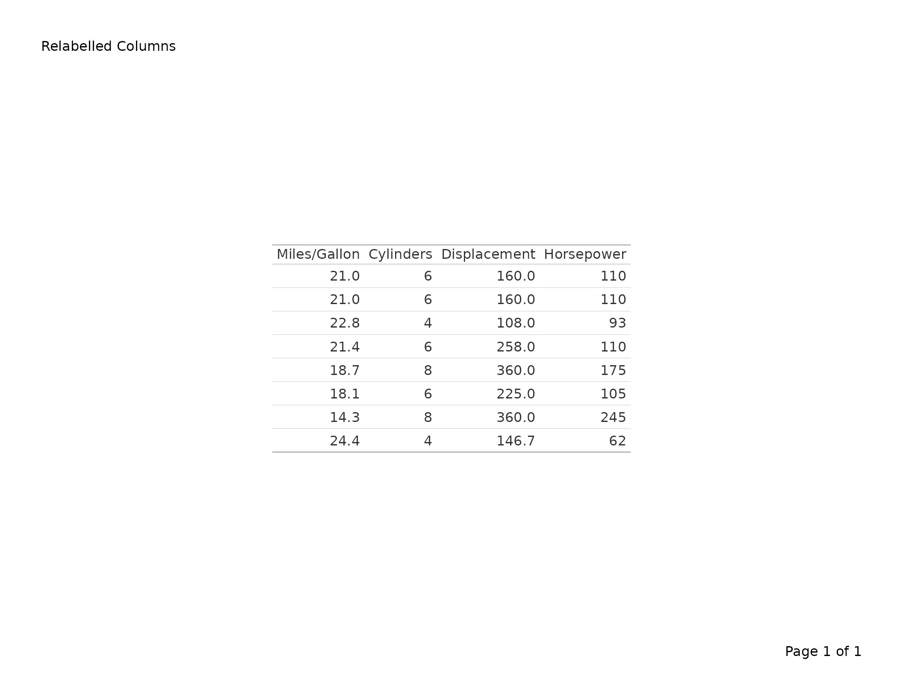
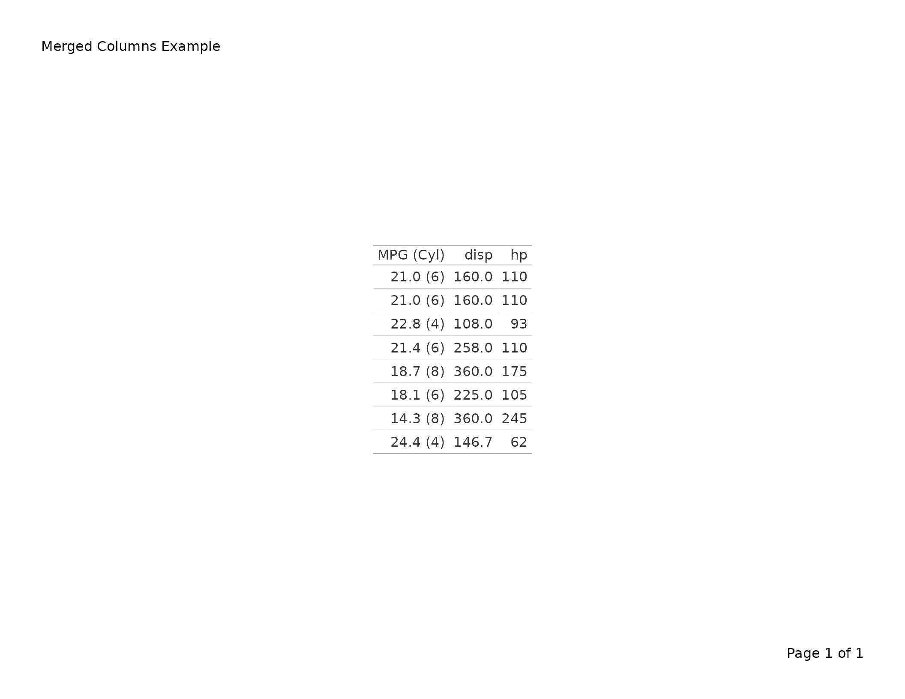
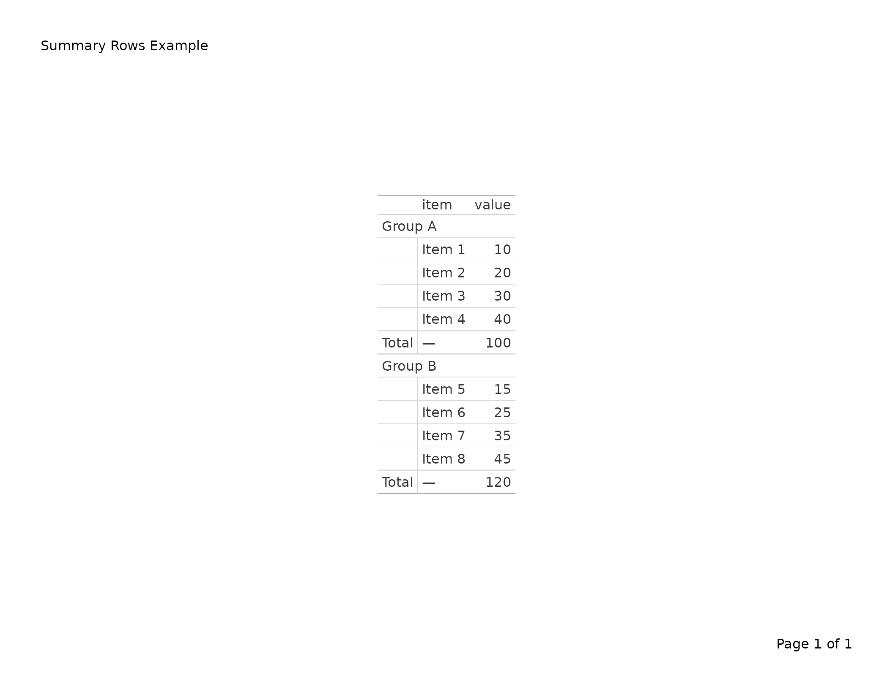

# Exporting gt Tables to PDF

This vignette covers
[`export_tfl()`](https://humanpred.github.io/writetfl/reference/export_tfl.md)
as used with `gt` table objects. For data-frame tables built with
[`tfl_table()`](https://humanpred.github.io/writetfl/reference/tfl_table.md),
see
[`vignette("v02-tfl_table_intro")`](https://humanpred.github.io/writetfl/articles/v02-tfl_table_intro.md).
For figure output, see
[`vignette("v01-figure_output")`](https://humanpred.github.io/writetfl/articles/v01-figure_output.md).

``` r
library(writetfl)
library(gt)
library(grid)
```

------------------------------------------------------------------------

## Basic usage

Pass a `gt_tbl` object directly to
[`export_tfl()`](https://humanpred.github.io/writetfl/reference/export_tfl.md).
The title, subtitle, source notes, and footnotes are automatically
extracted and placed in writetfl’s annotation zones (caption and
footnote), while the table body is rendered as a grid grob via
[`gt::as_gtable()`](https://gt.rstudio.com/reference/as_gtable.html).

``` r
tbl <- gt(head(mtcars, 10)) |>
  tab_header(
    title    = "Motor Trend Car Road Tests",
    subtitle = "First 10 observations"
  ) |>
  tab_source_note("Source: Motor Trend US magazine (1974).")

export_tfl(tbl, preview = TRUE)
```


### Why annotations are extracted

gt normally renders its title, subtitle, source notes, and footnotes
inside the table grob itself. When placed inside writetfl’s page layout,
this would cause duplication — the annotations would appear both in the
grob and in writetfl’s header/footer zones. To avoid this,
[`export_tfl()`](https://humanpred.github.io/writetfl/reference/export_tfl.md)
extracts gt annotations into writetfl’s annotation fields and strips
them from the gt object before converting to a grob.

The mapping is:

| gt annotation                | writetfl field                            |
|------------------------------|-------------------------------------------|
| `tab_header(title = ...)`    | `caption` (first line)                    |
| `tab_header(subtitle = ...)` | `caption` (second line, joined with `\n`) |
| `tab_source_note(...)`       | `footnote`                                |
| `tab_footnote(...)`          | `footnote` (combined with source notes)   |

------------------------------------------------------------------------

## Adding page layout elements

All of writetfl’s page layout arguments work with gt tables. Pass them
via `...` just as you would for figures.

``` r
tbl <- gt(head(iris, 15)) |>
  tab_header(title = "Iris Measurements") |>
  tab_source_note("Source: Fisher (1936).")

export_tfl(
  tbl,
  preview      = TRUE,
  header_left  = "Study Report",
  header_right = format(Sys.Date(), "%d %b %Y"),
  header_rule  = TRUE,
  footer_rule  = TRUE
)
```


------------------------------------------------------------------------

## Multiple gt tables

Pass a list of `gt_tbl` objects to produce a multi-page PDF with one
table per page. Each table’s annotations are extracted independently.

``` r
tbl1 <- gt(head(mtcars, 10)) |>
  tab_header(title = "Table 1. First 10 rows")

tbl2 <- gt(tail(mtcars, 10)) |>
  tab_header(title = "Table 2. Last 10 rows")

export_tfl(
  list(tbl1, tbl2),
  file         = "two-tables.pdf",
  header_left  = "Appendix",
  header_rule  = TRUE
)
```

------------------------------------------------------------------------

## Footnotes and source notes

Cell-level footnotes added via
[`tab_footnote()`](https://gt.rstudio.com/reference/tab_footnote.html)
and source notes added via
[`tab_source_note()`](https://gt.rstudio.com/reference/tab_source_note.html)
are combined into writetfl’s footnote zone.

``` r
tbl <- gt(head(mtcars[, 1:6], 8)) |>
  tab_header(title = "Fuel Economy Data") |>
  tab_footnote(
    "Highest in sample.",
    locations = cells_body(columns = mpg, rows = mpg == max(mpg))
  ) |>
  tab_source_note("Source: Motor Trend (1974).")

export_tfl(tbl, preview = TRUE)
```


------------------------------------------------------------------------

## Automatic pagination for tall tables

When a gt table is too tall to fit on a single page,
[`export_tfl()`](https://humanpred.github.io/writetfl/reference/export_tfl.md)
splits it across multiple pages automatically. Row group boundaries are
respected — a group is never split across pages.

``` r
# A large table that won't fit on one page
big_data <- data.frame(
  group = rep(c("Treatment A", "Treatment B", "Placebo"), each = 20),
  subject = paste0("SUBJ-", sprintf("%03d", 1:60)),
  value   = round(rnorm(60, 100, 15), 1)
)

tbl <- gt(big_data, groupname_col = "group") |>
  tab_header(title = "Subject-Level Results") |>
  tab_source_note("Source: Clinical Trial XY-001.")

export_tfl(
  tbl,
  file         = "paginated.pdf",
  header_left  = "Study Report",
  header_rule  = TRUE,
  footer_rule  = TRUE
)
```

Each page carries the same caption and footnote from the original gt
object. The column headers are repeated on every page since each page is
a complete gt sub-table.

### How pagination works

1.  The full table is converted to a grob and its height measured.
2.  If it fits within the available content area, a single page is
    produced.
3.  If it overflows, rows are split into groups:
    - **With
      [`tab_row_group()`](https://gt.rstudio.com/reference/tab_row_group.html)**:
      groups of rows defined by
      [`tab_row_group()`](https://gt.rstudio.com/reference/tab_row_group.html)
      are kept together. Pages are filled greedily by groups.
    - **Without row groups**: each row is treated as its own unit,
      allowing fine-grained page breaks.
4.  For each page chunk, a sub-table is built preserving column labels,
    `fmt_*()` formatting,
    [`tab_style()`](https://gt.rstudio.com/reference/tab_style.html)
    styling, column spanners, merged columns, and summary rows.

### Ungrouped tables

Tables without explicit row groups are split row-by-row:

``` r
tbl <- gt(mtcars) |>
  tab_header(title = "All 32 Cars") |>
  fmt_number(columns = mpg, decimals = 1)

export_tfl(tbl, file = "all-cars.pdf")
```

------------------------------------------------------------------------

## Preserved gt features

The following gt features are preserved through pagination:

| Feature                                                                      | Preserved? | Notes                                   |
|------------------------------------------------------------------------------|:----------:|-----------------------------------------|
| [`tab_header()`](https://gt.rstudio.com/reference/tab_header.html)           |    Yes     | Extracted as writetfl caption           |
| [`tab_source_note()`](https://gt.rstudio.com/reference/tab_source_note.html) |    Yes     | Extracted as writetfl footnote          |
| [`tab_footnote()`](https://gt.rstudio.com/reference/tab_footnote.html)       |    Yes     | Combined with source notes              |
| [`tab_row_group()`](https://gt.rstudio.com/reference/tab_row_group.html)     |    Yes     | Groups kept together across pages       |
| [`tab_spanner()`](https://gt.rstudio.com/reference/tab_spanner.html)         |    Yes     | Column spanners repeated on every page  |
| `fmt_*()` functions                                                          |    Yes     | Re-indexed per page subset              |
| [`tab_style()`](https://gt.rstudio.com/reference/tab_style.html)             |    Yes     | Re-indexed per page subset              |
| [`cols_merge()`](https://gt.rstudio.com/reference/cols_merge.html)           |    Yes     | Carried through boxhead                 |
| [`summary_rows()`](https://gt.rstudio.com/reference/summary_rows.html)       |    Yes     | Filtered to groups present on each page |
| [`cols_label()`](https://gt.rstudio.com/reference/cols_label.html)           |    Yes     | Carried through boxhead                 |

``` r
tbl <- gt(mtcars[, 1:6]) |>
  tab_header(title = "Motor Trend Data") |>
  tab_spanner(label = "Performance", columns = c(mpg, cyl, disp)) |>
  tab_spanner(label = "Engine", columns = c(hp, drat, wt)) |>
  fmt_number(columns = mpg, decimals = 1) |>
  tab_style(
    style = cell_fill(color = "lightyellow"),
    locations = cells_body(columns = mpg)
  )

export_tfl(tbl, file = "styled.pdf")
```

### Column labels

Custom column labels set with
[`cols_label()`](https://gt.rstudio.com/reference/cols_label.html) are
preserved through pagination. Labels are stored in the boxhead metadata
and carried to every page.

``` r
tbl <- gt(head(mtcars[, 1:4], 8)) |>
  tab_header(title = "Relabelled Columns") |>
  cols_label(
    mpg  = "Miles/Gallon",
    cyl  = "Cylinders",
    disp = "Displacement",
    hp   = "Horsepower"
  )

export_tfl(tbl, preview = TRUE)
```



### Merged columns

[`cols_merge()`](https://gt.rstudio.com/reference/cols_merge.html)
combines the display of two or more columns into one. This is carried
through the boxhead and works across paginated pages.

``` r
tbl <- gt(head(mtcars[, 1:4], 8)) |>
  tab_header(title = "Merged Columns Example") |>
  cols_merge(
    columns = c(mpg, cyl),
    pattern = "{1} ({2})"
  ) |>
  cols_label(mpg = "MPG (Cyl)")

export_tfl(tbl, preview = TRUE)
```



### Summary rows

[`summary_rows()`](https://gt.rstudio.com/reference/summary_rows.html)
adds group-level summaries. During pagination, summaries are filtered to
groups present on each page.

``` r
df <- data.frame(
  group = rep(c("Group A", "Group B"), each = 4),
  item  = paste0("Item ", 1:8),
  value = c(10, 20, 30, 40, 15, 25, 35, 45)
)

tbl <- gt(df, groupname_col = "group") |>
  tab_header(title = "Summary Rows Example") |>
  summary_rows(
    groups = everything(),
    columns = value,
    fns = list(Total = ~ sum(.))
  )

export_tfl(tbl, preview = TRUE)
```


