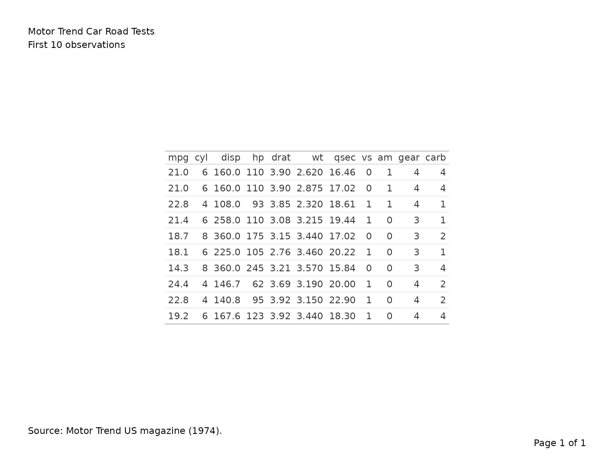
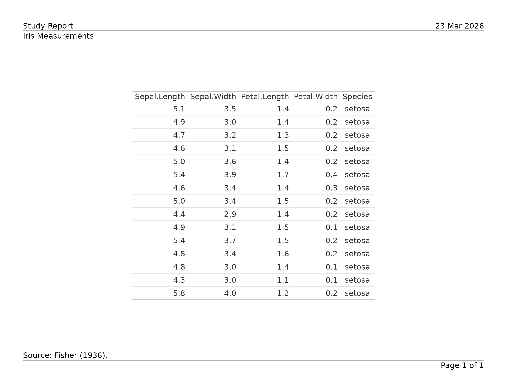
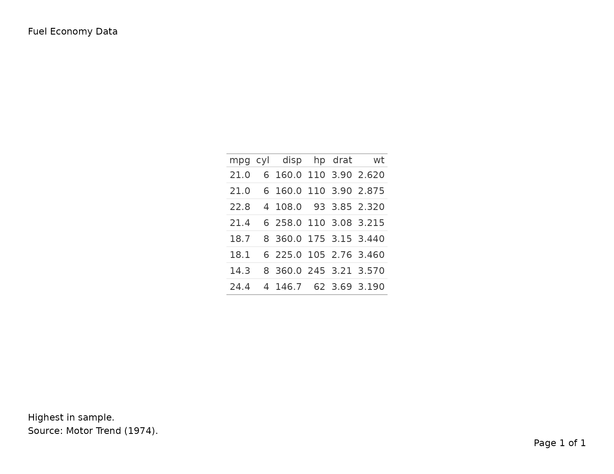

# Exporting gt Tables to PDF

This vignette covers
[`export_tfl()`](https://humanpred.github.io/writetfl/reference/export_tfl.md)
as used with `gt` table objects. For data-frame tables built with
[`tfl_table()`](https://humanpred.github.io/writetfl/reference/tfl_table.md),
see
[`vignette("v02-tfl_table_intro")`](https://humanpred.github.io/writetfl/articles/v02-tfl_table_intro.md).
For figure output, see
[`vignette("v01-figure_output")`](https://humanpred.github.io/writetfl/articles/v01-figure_output.md).

``` r
library(writetfl)
library(gt)
library(grid)
```

------------------------------------------------------------------------

## Basic usage

Pass a `gt_tbl` object directly to
[`export_tfl()`](https://humanpred.github.io/writetfl/reference/export_tfl.md).
The title, subtitle, source notes, and footnotes are automatically
extracted and placed in writetfl’s annotation zones (caption and
footnote), while the table body is rendered as a grid grob via
[`gt::as_gtable()`](https://gt.rstudio.com/reference/as_gtable.html).

``` r
tbl <- gt(head(mtcars, 10)) |>
  tab_header(
    title    = "Motor Trend Car Road Tests",
    subtitle = "First 10 observations"
  ) |>
  tab_source_note("Source: Motor Trend US magazine (1974).")

export_tfl(tbl, preview = TRUE)
```



### Why annotations are extracted

gt normally renders its title, subtitle, source notes, and footnotes
inside the table grob itself. When placed inside writetfl’s page layout,
this would cause duplication — the annotations would appear both in the
grob and in writetfl’s header/footer zones. To avoid this,
[`export_tfl()`](https://humanpred.github.io/writetfl/reference/export_tfl.md)
extracts gt annotations into writetfl’s annotation fields and strips
them from the gt object before converting to a grob.

The mapping is:

| gt annotation                | writetfl field                            |
|------------------------------|-------------------------------------------|
| `tab_header(title = ...)`    | `caption` (first line)                    |
| `tab_header(subtitle = ...)` | `caption` (second line, joined with `\n`) |
| `tab_source_note(...)`       | `footnote`                                |
| `tab_footnote(...)`          | `footnote` (combined with source notes)   |

------------------------------------------------------------------------

## Adding page layout elements

All of writetfl’s page layout arguments work with gt tables. Pass them
via `...` just as you would for figures.

``` r
tbl <- gt(head(iris, 15)) |>
  tab_header(title = "Iris Measurements") |>
  tab_source_note("Source: Fisher (1936).")

export_tfl(
  tbl,
  preview      = TRUE,
  header_left  = "Study Report",
  header_right = format(Sys.Date(), "%d %b %Y"),
  header_rule  = TRUE,
  footer_rule  = TRUE
)
```



------------------------------------------------------------------------

## Multiple gt tables

Pass a list of `gt_tbl` objects to produce a multi-page PDF with one
table per page. Each table’s annotations are extracted independently.

``` r
tbl1 <- gt(head(mtcars, 10)) |>
  tab_header(title = "Table 1. First 10 rows")

tbl2 <- gt(tail(mtcars, 10)) |>
  tab_header(title = "Table 2. Last 10 rows")

export_tfl(
  list(tbl1, tbl2),
  file         = "two-tables.pdf",
  header_left  = "Appendix",
  header_rule  = TRUE
)
```

------------------------------------------------------------------------

## Footnotes and source notes

Cell-level footnotes added via
[`tab_footnote()`](https://gt.rstudio.com/reference/tab_footnote.html)
and source notes added via
[`tab_source_note()`](https://gt.rstudio.com/reference/tab_source_note.html)
are combined into writetfl’s footnote zone.

``` r
tbl <- gt(head(mtcars[, 1:6], 8)) |>
  tab_header(title = "Fuel Economy Data") |>
  tab_footnote(
    "Highest in sample.",
    locations = cells_body(columns = mpg, rows = mpg == max(mpg))
  ) |>
  tab_source_note("Source: Motor Trend (1974).")

export_tfl(tbl, preview = TRUE)
```



------------------------------------------------------------------------

## Limitations and future work

Phase 1 of the gt connector covers single-page rendering with annotation
extraction. The following features are planned for future phases:

- **Row-group pagination**: Automatically split tall gt tables across
  multiple pages, respecting row group boundaries.
- **Formatting preservation**: Preserve `fmt_*()` column formatting and
  [`tab_style()`](https://gt.rstudio.com/reference/tab_style.html)
  cell-level styling through pagination.
- **Advanced features**: Preserve column spanners
  ([`tab_spanner()`](https://gt.rstudio.com/reference/tab_spanner.html)),
  merged columns
  ([`cols_merge()`](https://gt.rstudio.com/reference/cols_merge.html)),
  and summary rows.
