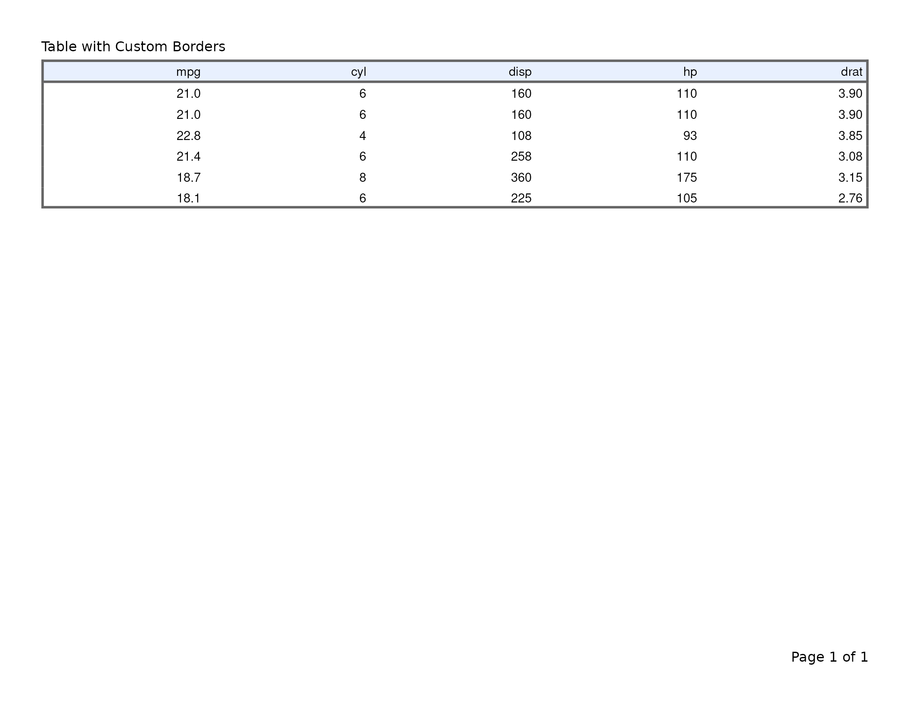

# Exporting flextable Tables to PDF

This vignette covers
[`export_tfl()`](https://humanpred.github.io/writetfl/reference/export_tfl.md)
as used with flextable objects. For data-frame tables built with
[`tfl_table()`](https://humanpred.github.io/writetfl/reference/tfl_table.md),
see
[`vignette("v02-tfl_table_intro")`](https://humanpred.github.io/writetfl/articles/v02-tfl_table_intro.md).
For gt tables, see
[`vignette("v05-gt_tables")`](https://humanpred.github.io/writetfl/articles/v05-gt_tables.md).
For rtables tables, see
[`vignette("v06-rtables")`](https://humanpred.github.io/writetfl/articles/v06-rtables.md).
For figure output, see
[`vignette("v01-figure_output")`](https://humanpred.github.io/writetfl/articles/v01-figure_output.md).

``` r
library(writetfl)
library(flextable)
library(grid)
```

------------------------------------------------------------------------

## Basic usage

Pass a `flextable` object directly to
[`export_tfl()`](https://humanpred.github.io/writetfl/reference/export_tfl.md).
Captions set via
[`set_caption()`](https://davidgohel.github.io/flextable/reference/set_caption.html)
are automatically extracted and placed in writetfl’s caption zone.
Footer rows (from
[`footnote()`](https://davidgohel.github.io/flextable/reference/footnote.html)
or
[`add_footer_lines()`](https://davidgohel.github.io/flextable/reference/add_footer_lines.html))
are extracted into writetfl’s footnote zone.

``` r
ft <- flextable(head(iris, 10)) |>
  set_caption("Iris Measurements — First 10 Rows") |>
  add_footer_lines("Source: Anderson (1935).")

export_tfl(ft, preview = TRUE)
```


------------------------------------------------------------------------

## Caption handling

The caption from
[`set_caption()`](https://davidgohel.github.io/flextable/reference/set_caption.html)
is placed in writetfl’s caption section above the table. It does not
appear in the
[`gen_grob()`](https://davidgohel.github.io/flextable/reference/gen_grob.html)
output (flextable reserves captions for document formats like Word and
HTML), so there is no duplication.

``` r
ft <- flextable(head(mtcars[, 1:6], 8)) |>
  set_caption("Table 1. Selected Motor Trend Variables")

export_tfl(ft, preview = TRUE,
  header_left = "Appendix A",
  header_rule = TRUE,
  footer_rule = TRUE
)
```


------------------------------------------------------------------------

## Footnote extraction

Footer rows added via
[`footnote()`](https://davidgohel.github.io/flextable/reference/footnote.html)
or
[`add_footer_lines()`](https://davidgohel.github.io/flextable/reference/add_footer_lines.html)
are extracted as plain text and placed in writetfl’s footnote zone below
the table. The footer rows are removed from the flextable before
rendering so they don’t appear twice.

When
[`footnote()`](https://davidgohel.github.io/flextable/reference/footnote.html)
is used, the superscript reference symbols in body cells are preserved —
they still point to the footnotes now positioned in writetfl’s footnote
section.

``` r
ft <- flextable(head(iris, 8)) |>
  set_caption("Table 2. Iris with Footnotes")

ft <- footnote(ft, i = 1, j = 1, part = "body",
  value = as_paragraph("Measured in centimetres."),
  ref_symbols = "a"
)
ft <- footnote(ft, i = 1, j = 3, part = "body",
  value = as_paragraph("Petal measurements are less variable."),
  ref_symbols = "b"
)

export_tfl(ft, preview = TRUE,
  header_left  = "Study Report",
  header_rule  = TRUE,
  footer_rule  = TRUE
)
```


------------------------------------------------------------------------

## Adding page layout elements

All of writetfl’s page layout arguments work with flextable tables. Pass
them via `...` just as you would for figures.

``` r
ft <- flextable(head(mtcars[, 1:6], 10)) |>
  set_caption("Table 3. Motor Trend Cars") |>
  add_footer_lines("Source: Motor Trend (1974).")

export_tfl(
  ft,
  preview      = TRUE,
  header_left  = "Study Report",
  header_right = format(Sys.Date(), "%d %b %Y"),
  header_rule  = TRUE,
  footer_rule  = TRUE
)
```


------------------------------------------------------------------------

## Multiple flextable tables

Pass a list of `flextable` objects to produce a multi-page PDF with one
table per page.

``` r
ft1 <- flextable(head(iris, 10)) |>
  set_caption("Table 1. Iris (first 10 rows)")

ft2 <- flextable(tail(iris, 10)) |>
  set_caption("Table 2. Iris (last 10 rows)")

export_tfl(
  list(ft1, ft2),
  file         = "two-tables.pdf",
  header_left  = "Appendix",
  header_rule  = TRUE
)
```

------------------------------------------------------------------------

## Automatic pagination

When a flextable table is too tall to fit on a single page,
[`export_tfl()`](https://humanpred.github.io/writetfl/reference/export_tfl.md)
splits it across pages by subsetting body rows. The header is repeated
on each page, and caption and footnote are carried through to every
page.

``` r
big_data <- data.frame(
  ID     = seq_len(60),
  Name   = paste("Subject", seq_len(60)),
  Age    = sample(25:75, 60, replace = TRUE),
  Weight = round(rnorm(60, 70, 12), 1),
  Score  = round(runif(60, 50, 100), 1),
  Group  = rep(c("Treatment", "Control"), each = 30)
)

big_ft <- flextable(big_data) |>
  set_caption("Table 5. Subject Listing — Full Cohort") |>
  add_footer_lines("Source: Simulated clinical trial data.") |>
  theme_booktabs()

export_tfl(
  big_ft,
  preview      = 1:2,
  header_left  = "Analysis Report",
  header_rule  = TRUE,
  footer_rule  = TRUE
)
```


**Note:** When pagination occurs, per-cell formatting applied via
[`color()`](https://davidgohel.github.io/flextable/reference/color.html),
[`bg()`](https://davidgohel.github.io/flextable/reference/bg.html),
[`bold()`](https://davidgohel.github.io/flextable/reference/bold.html),
etc. is not preserved on paginated pages. Themes (e.g.,
[`theme_vanilla()`](https://davidgohel.github.io/flextable/reference/theme_vanilla.html))
are not re-applied. For tables with extensive cell-level formatting,
ensure the table fits on a single page or split the data manually before
creating flextable objects.

------------------------------------------------------------------------

## Preserved features

The following flextable features are preserved through the
[`gen_grob()`](https://davidgohel.github.io/flextable/reference/gen_grob.html)
rendering pipeline:

| Feature                                                                                                                                                                                                                                    | Preserved? | Notes                                                                     |
|--------------------------------------------------------------------------------------------------------------------------------------------------------------------------------------------------------------------------------------------|:----------:|---------------------------------------------------------------------------|
| [`set_caption()`](https://davidgohel.github.io/flextable/reference/set_caption.html)                                                                                                                                                       |    Yes     | Extracted as writetfl caption                                             |
| [`footnote()`](https://davidgohel.github.io/flextable/reference/footnote.html)                                                                                                                                                             |    Yes     | Text extracted as writetfl footnote; reference symbols preserved in cells |
| [`add_footer_lines()`](https://davidgohel.github.io/flextable/reference/add_footer_lines.html)                                                                                                                                             |    Yes     | Extracted as writetfl footnote                                            |
| [`add_header_row()`](https://davidgohel.github.io/flextable/reference/add_header_row.html)                                                                                                                                                 |    Yes     | Rendered as part of table header                                          |
| [`add_header_lines()`](https://davidgohel.github.io/flextable/reference/add_header_lines.html)                                                                                                                                             |    Yes     | Rendered as part of table header                                          |
| [`set_header_labels()`](https://davidgohel.github.io/flextable/reference/set_header_labels.html)                                                                                                                                           |    Yes     | Column header labels                                                      |
| [`merge_v()`](https://davidgohel.github.io/flextable/reference/merge_v.html), [`merge_h()`](https://davidgohel.github.io/flextable/reference/merge_h.html), [`merge_at()`](https://davidgohel.github.io/flextable/reference/merge_at.html) |    Yes     | Cell merging                                                              |
| [`border()`](https://davidgohel.github.io/flextable/reference/border.html), [`hline()`](https://davidgohel.github.io/flextable/reference/hline.html), [`vline()`](https://davidgohel.github.io/flextable/reference/vline.html)             |    Yes     | All border styles                                                         |
| [`color()`](https://davidgohel.github.io/flextable/reference/color.html), [`bg()`](https://davidgohel.github.io/flextable/reference/bg.html)                                                                                               |    Yes     | Text and background colours                                               |
| [`bold()`](https://davidgohel.github.io/flextable/reference/bold.html), [`italic()`](https://davidgohel.github.io/flextable/reference/italic.html)                                                                                         |    Yes     | Text emphasis                                                             |
| [`align()`](https://davidgohel.github.io/flextable/reference/align.html), [`align_text_col()`](https://davidgohel.github.io/flextable/reference/align.html)                                                                                |    Yes     | Cell alignment                                                            |
| `theme_*()` functions                                                                                                                                                                                                                      |    Yes     | All built-in themes                                                       |
| `colformat_*()` functions                                                                                                                                                                                                                  |    Yes     | Number/date formatting                                                    |
| [`width()`](https://davidgohel.github.io/flextable/reference/width.html), [`height()`](https://davidgohel.github.io/flextable/reference/height.html)                                                                                       |    Yes     | Column widths scaled to fit page                                          |
| [`as_image()`](https://davidgohel.github.io/flextable/reference/as_image.html), [`as_raster()`](https://davidgohel.github.io/flextable/reference/as_raster.html)                                                                           |  Partial   | Images render but require appropriate device                              |
| [`as_equation()`](https://davidgohel.github.io/flextable/reference/as_equation.html)                                                                                                                                                       |     No     | Equations not supported in grid rendering                                 |
| [`hyperlink_text()`](https://davidgohel.github.io/flextable/reference/hyperlink_text.html)                                                                                                                                                 |     No     | Hyperlinks not supported in grid/PDF                                      |

### Themes

``` r
ft <- flextable(head(iris, 8)) |>
  set_caption("Table with Booktabs Theme") |>
  theme_booktabs()

export_tfl(ft, preview = TRUE)
```


### Merged cells

``` r
ft <- flextable(head(iris, 8)) |>
  set_caption("Table with Merged Cells") |>
  merge_v(j = "Species")

export_tfl(ft, preview = TRUE)
```


### Borders and colours

``` r
ft <- flextable(head(mtcars[, 1:5], 6)) |>
  set_caption("Table with Custom Borders") |>
  border_outer(border = fp_border_default(width = 2)) |>
  bg(i = 1, bg = "#E8F0FE", part = "header")

export_tfl(ft, preview = TRUE)
```


