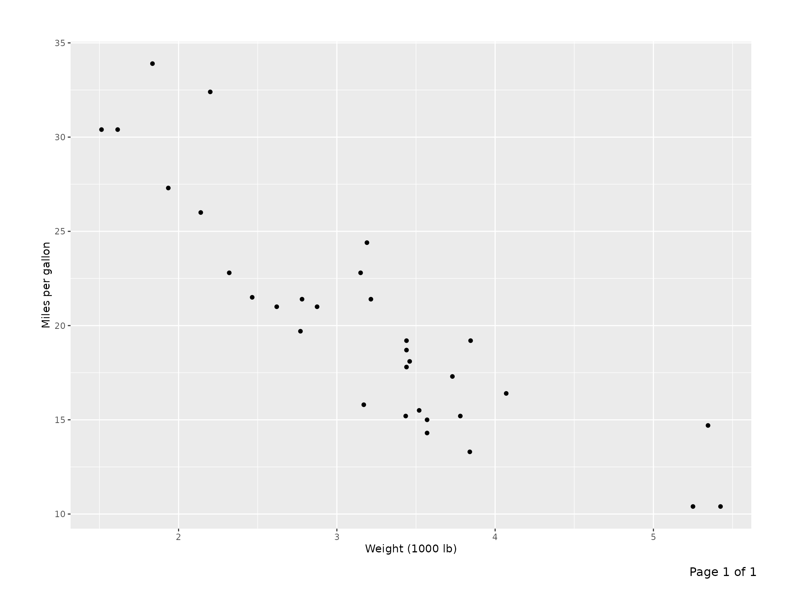
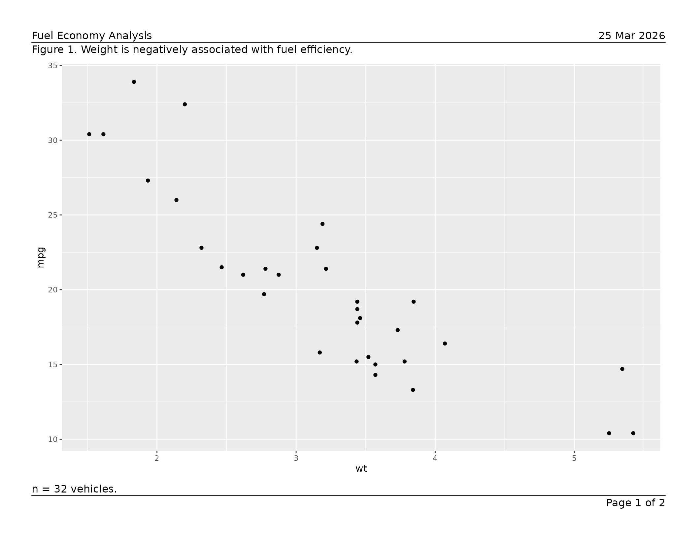
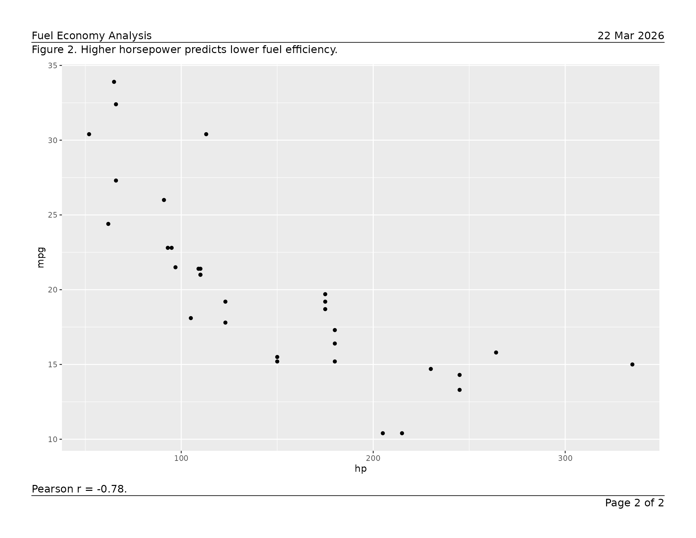
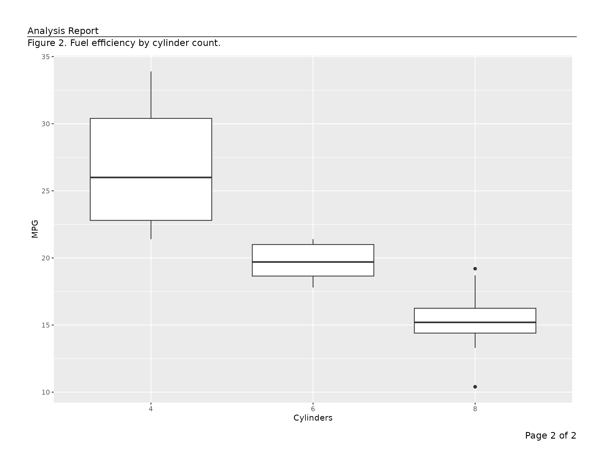
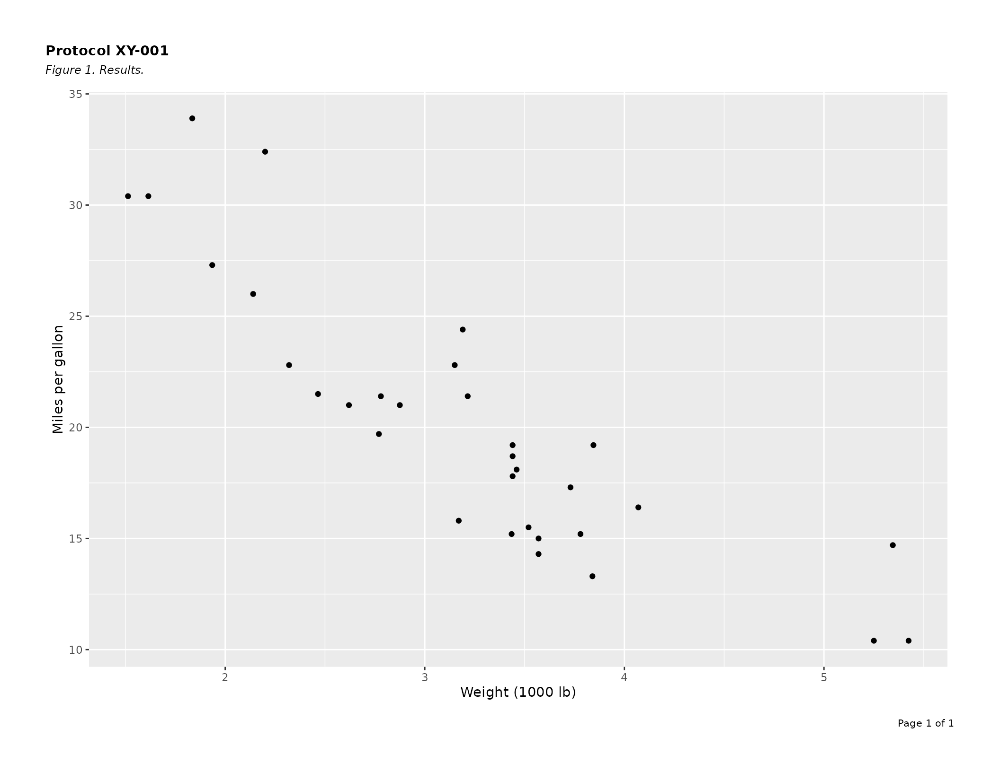
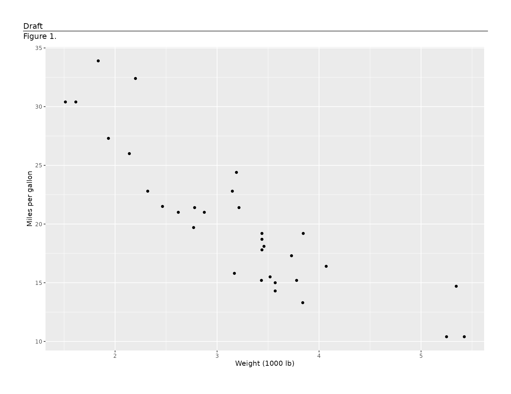

# Getting Started with writetfl

``` r
library(writetfl)
library(ggplot2)
library(dplyr)
#> 
#> Attaching package: 'dplyr'
#> The following objects are masked from 'package:stats':
#> 
#>     filter, lag
#> The following objects are masked from 'package:base':
#> 
#>     intersect, setdiff, setequal, union
```

`writetfl` produces multi-page PDF files from `ggplot2` figures,
data-frame tables, and other grid content with precise, composable page
layouts required for clinical trial TFL deliverables and regulatory
submissions.

Each page is divided into up to five vertical sections — header,
caption, content, footnote, and footer — whose heights are computed
dynamically from live font metrics so that the content area always fills
exactly the remaining space. Nothing ever overlaps.

------------------------------------------------------------------------

## Page layout

Every page follows this structure:

    ┌─────────────────────────────────────────────────┐  ← page edge
    │              (outer margin)                     │
    │  ┌───────────────────────────────────────────┐  │
    │  │  header_left  header_center  header_right │  │  header
    │  │  ---------------------------------------- │  │  ← header_rule (optional)
    │  │  caption                                  │  │  caption
    │  │                                           │  │
    │  │         content (fills remainder)         │  │  content
    │  │                                           │  │
    │  │  footnote                                 │  │  footnote
    │  │  ---------------------------------------- │  │  ← footer_rule (optional)
    │  │  footer_left  footer_center  footer_right │  │  footer
    │  └───────────────────────────────────────────┘  │
    │              (outer margin)                     │
    └─────────────────────────────────────────────────┘

Absent sections and their padding gaps are suppressed entirely — no
blank space is reserved for them.

------------------------------------------------------------------------

## Figures

Pass a single `ggplot` directly. `"Page 1 of 1"` is added to the footer
automatically.

``` r
p <- ggplot(mtcars, aes(wt, mpg)) +
  geom_point() +
  labs(x = "Weight (1000 lb)", y = "Miles per gallon")

export_tfl(p, preview = TRUE)
```



Build a multi-page report by supplying a list of page specs. Arguments
in `...` are shared across all pages; values inside a page’s list
element take priority.

``` r
pages <- list(
  list(
    content  = ggplot(mtcars, aes(wt, mpg))  + geom_point(),
    caption  = "Figure 1. Weight is negatively associated with fuel efficiency.",
    footnote = "n = 32 vehicles."
  ),
  list(
    content  = ggplot(mtcars, aes(hp, mpg))  + geom_point(),
    caption  = "Figure 2. Higher horsepower predicts lower fuel efficiency.",
    footnote = "Pearson r = -0.78."
  )
)

export_tfl(
  pages,
  preview      = TRUE,
  header_left  = "Fuel Economy Analysis",
  header_right = format(Sys.Date(), "%d %b %Y"),
  header_rule  = TRUE,
  footer_rule  = TRUE
)
```



For the full set of layout controls — separator rules, typography,
multi-line text, overlap detection, preview mode, and more — see
[`vignette("figure_output")`](https://humanpred.github.io/writetfl/articles/figure_output.md).

------------------------------------------------------------------------

## Data-frame tables

[`tfl_table()`](https://humanpred.github.io/writetfl/reference/tfl_table.md)
converts a data frame into a paginated table grob. Pass the result
directly to
[`export_tfl()`](https://humanpred.github.io/writetfl/reference/export_tfl.md).

``` r
ae_summary <- data.frame(
  system_organ_class = c("Gastrointestinal", "Nervous system", "Skin"),
  n_subjects         = c(12L, 7L, 4L),
  pct                = c(24.0, 14.0, 8.0)
)

tbl <- tfl_table(
  ae_summary,
  col_labels = c(system_organ_class = "System Organ Class",
                 n_subjects = "n", pct = "(%)"),
  col_align  = c(system_organ_class = "left",
                 n_subjects = "right", pct = "right")
)

export_tfl(
  tbl,
  preview     = TRUE,
  header_left = "Table 1. Adverse Events by System Organ Class",
  footnote    = "Percentages are based on the safety population (N = 50)."
)
```


Use
[`dplyr::group_by()`](https://dplyr.tidyverse.org/reference/group_by.html)
to designate row-header columns. Group columns repeat on every
column-split page and suppress repeated values in consecutive rows.

``` r
pk_data <- data.frame(
  visit     = rep(c("Week 4", "Week 8", "Week 12"), each = 4),
  treatment = rep(c("Placebo", "Active 10 mg", "Active 20 mg", "Active 40 mg"), 3),
  n         = c(48L, 50L, 49L, 51L, 45L, 47L, 48L, 50L, 41L, 43L, 44L, 46L),
  mean_auc  = c(120.4, 145.2, 178.9, 201.3,
                118.7, 148.6, 185.2, 219.4,
                115.1, 152.3, 191.7, 228.6),
  stringsAsFactors = FALSE
)

pk_data |>
  group_by(visit) |>
  tfl_table(
    col_labels = c(visit = "Visit", treatment = "Treatment",
                   n = "n", mean_auc = "Mean AUC\n(ng\u00b7h/mL)")
  ) |>
  export_tfl(
    preview     = 1,
    header_left = "Table 2. PK Summary by Visit"
  )
```


[`tfl_table()`](https://humanpred.github.io/writetfl/reference/tfl_table.md)
paginates automatically:

- **Row pagination** — rows split across pages with optional
  `(continued)` markers; groups are kept together where possible.
- **Column pagination** — columns that exceed the page width are split
  across pages; set `balance_col_pages = TRUE` to distribute columns
  evenly.
- **Column widths** — auto-sized from content, fixed
  ([`unit()`](https://rdrr.io/r/grid/unit.html)), or relative-weight
  numeric.
- **Word wrapping** — `wrap_cols` reflows long text within a fixed
  column width.

For the complete table reference — column specs, continuation messages,
cell padding, line height, and more — see
[`vignette("tfl_table_intro")`](https://humanpred.github.io/writetfl/articles/tfl_table_intro.md).

For table typography and styling, see
[`vignette("tfl_table_styling")`](https://humanpred.github.io/writetfl/articles/tfl_table_styling.md).

------------------------------------------------------------------------

## Multi-page reports

[`export_tfl()`](https://humanpred.github.io/writetfl/reference/export_tfl.md)
accepts a list of page specifications, so different figures can coexist
in one PDF with per-page captions, footnotes, or other annotations
alongside any shared header and footer.

``` r
export_tfl(
  list(
    list(content = ggplot(mtcars, aes(wt, mpg)) + geom_point(),
         caption  = "Figure 1. Weight vs fuel efficiency.",
         footnote = "Pearson r = -0.87."),
    list(content = ggplot(mtcars, aes(factor(cyl), mpg)) + geom_boxplot() +
                     labs(x = "Cylinders", y = "MPG"),
         caption  = "Figure 2. Fuel efficiency by cylinder count.")
  ),
  preview     = TRUE,
  header_left = "Analysis Report",
  header_rule = TRUE
)
```



[`tfl_table()`](https://humanpred.github.io/writetfl/reference/tfl_table.md)
objects are passed as the top-level `x` argument to
[`export_tfl()`](https://humanpred.github.io/writetfl/reference/export_tfl.md)
rather than inside a page spec list — the function handles pagination
and page construction automatically in that case.

------------------------------------------------------------------------

## Key shared features

### Automatic page numbering

`page_num` (default `"Page {i} of {n}"`) fills `footer_right` unless a
`footer_right` value is already set. Use a
[glue](https://glue.tidyverse.org/) template or `NULL` to disable.

``` r
export_tfl(pages, file = "numbered.pdf", page_num = "{i} / {n}")
export_tfl(pages, file = "no-numbers.pdf", page_num = NULL)
```

### Typography

Pass a bare [`gpar()`](https://rdrr.io/r/grid/gpar.html) to style all
annotation text uniformly, or a named list for section- or element-level
control. Resolution priority (highest wins): element → section → global.

``` r
export_tfl(
  p,
  preview     = TRUE,
  header_left = "Protocol XY-001",
  caption     = "Figure 1. Results.",
  gp = list(
    header  = gpar(fontsize = 11, fontface = "bold"),
    caption = gpar(fontsize =  9, fontface = "italic"),
    footer  = gpar(fontsize =  8)
  )
)
```



### Preview mode

`export_tfl(..., preview = TRUE)` draws to the currently open device
without opening or closing a PDF — useful for interactive layout tuning
in RStudio or Positron, and for inline graphics in vignettes. Pass an
integer vector to render specific pages only.

``` r
export_tfl_page(
  x            = list(content = p),
  header_left  = "Draft",
  caption      = "Figure 1.",
  header_rule  = TRUE,
  preview      = TRUE
)
```



------------------------------------------------------------------------

## Vignette index

| Vignette                                                                                              | What it covers                                                                                                                                                                                                                                                                     |
|-------------------------------------------------------------------------------------------------------|------------------------------------------------------------------------------------------------------------------------------------------------------------------------------------------------------------------------------------------------------------------------------------|
| [`vignette("writetfl")`](https://humanpred.github.io/writetfl/articles/writetfl.md)                   | This overview                                                                                                                                                                                                                                                                      |
| [`vignette("figure_output")`](https://humanpred.github.io/writetfl/articles/figure_output.md)         | Full [`export_tfl()`](https://humanpred.github.io/writetfl/reference/export_tfl.md) / [`export_tfl_page()`](https://humanpred.github.io/writetfl/reference/export_tfl_page.md) reference for figures: page dimensions, margins, rules, typography, overlap detection, preview mode |
| [`vignette("tfl_table_intro")`](https://humanpred.github.io/writetfl/articles/tfl_table_intro.md)     | [`tfl_table()`](https://humanpred.github.io/writetfl/reference/tfl_table.md) in depth: column specs, widths, alignment, wrapping, row/column pagination, group columns                                                                                                             |
| [`vignette("tfl_table_styling")`](https://humanpred.github.io/writetfl/articles/tfl_table_styling.md) | Table typography with `gp`: per-section and per-element [`gpar()`](https://rdrr.io/r/grid/gpar.html) overrides, cell padding, line height                                                                                                                                          |
